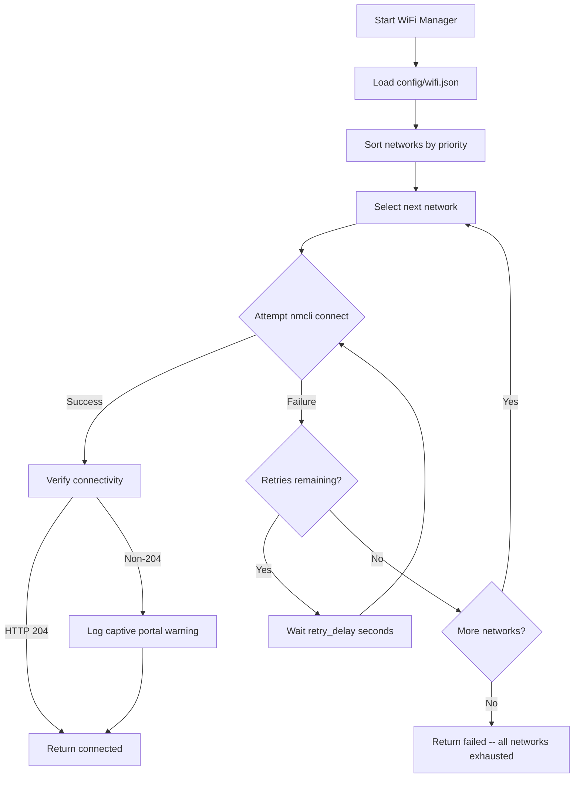
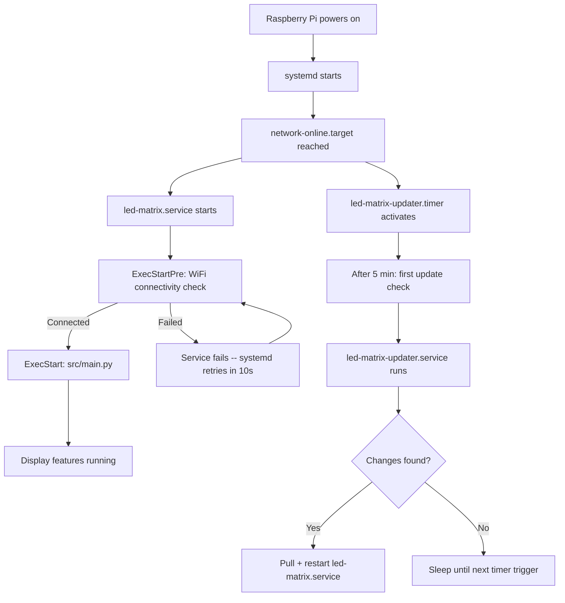

# LED_MATRIX-Project -- Revamp Architecture Plan

> This document defines the target architecture for the LED Matrix Project revamp.
> It covers project structure, subsystem design, configuration schemas, and system integration.

---

## 1. Project Structure

The revamped project replaces the current flat layout with a modular directory structure.

```
LED_MATRIX-Project/
  config/
    config.json              # Feature sequence + update settings
    wifi.json                # WiFi network configuration
    youtube_urls.csv         # YouTube playlist for stream feature
  scripts/
    install.sh               # One-time setup: venv, deps, systemd install
    update.sh                # Auto-update logic (called by updater service)
  services/
    led-matrix.service       # systemd unit -- display process
    led-matrix-updater.service   # systemd unit -- auto-updater (separate)
    led-matrix-updater.timer     # systemd timer -- periodic update checks
  src/
    __init__.py
    main.py                  # Single entry point
    config_validator.py      # Schema validation for config files
    display/
      __init__.py
      tic_tac_toe.py
      snake.py
      pong.py
      billiards.py
      time_display.py
      bitcoin_price.py
      youtube_stream.py
    wifi/
      __init__.py
      manager.py             # WiFi connection manager
    updater/
      __init__.py
      auto_update.py         # Git-based auto-updater
    simulator/               # Pygame-based LED matrix simulator for dev
      __init__.py
      matrix.py              # Simulated RGBMatrix / RGBMatrixOptions
      graphics.py            # Simulated graphics (Color, Font, Draw*)
  rgbmatrix/                 # LED matrix Cython library (Pi only)
    __init__.py
    core.pxd
    core.pyx
    cppinc.pxd
    graphics.pxd
    graphics.pyx
    Makefile
  tests/                     # Test suite (runs in simulator, no Pi needed)
    __init__.py
    conftest.py
    test_simulator.py
    test_config_validator.py
    test_display_modules.py
    test_integration.py
  logs/                      # Runtime logs (gitignored)
  requirements.txt
  pytest.ini                 # Pytest configuration
  README.md
  .gitignore
```

### Key changes from current layout

| Aspect | Current | Revamped |
|---|---|---|
| Python sources | Root directory (flat) | `src/` with subpackages |
| Config files | `config.json` in root | `config/config.json`, `config/wifi.json` |
| Shell scripts | Root (`install_and_update.sh`, `add_to_startup.sh`) | `scripts/install.sh`, `scripts/update.sh` |
| Systemd units | None (cron-based startup) | `services/*.service`, `services/*.timer` |
| Entry point | `consolidated_games.py` | `src/main.py` |
| Legacy files | `fix_python_path.bat`, VLC deps | Removed |

---

## 2. WiFi Configuration System

### Purpose

Enable the Raspberry Pi to automatically connect to configured WiFi networks on boot, including open/public networks and networks requiring captive portal handling.

### Design

```
                +------------------+
                | config/wifi.json |
                +--------+---------+
                         |
                         v
              +----------+----------+
              | src/wifi/manager.py |
              +----------+----------+
                         |
                   uses nmcli
                         |
                         v
              +----------+----------+
              |   NetworkManager    |
              +---------------------+
```

### Configuration: `config/wifi.json`

```json
{
  "networks": [
    {
      "ssid": "MyPublicWiFi",
      "password": "",
      "priority": 1,
      "hidden": false
    },
    {
      "ssid": "BackupNetwork",
      "password": "optional_password",
      "priority": 2,
      "hidden": false
    }
  ],
  "connection_timeout": 30,
  "retry_attempts": 3,
  "retry_delay": 10
}
```

| Field | Type | Description |
|---|---|---|
| `networks[].ssid` | string | Network name |
| `networks[].password` | string | Empty string for open networks |
| `networks[].priority` | integer | Lower number = higher priority; try in order |
| `networks[].hidden` | boolean | If true, use `nmcli` hidden network scan |
| `connection_timeout` | integer | Seconds to wait for connection per attempt |
| `retry_attempts` | integer | Number of retries before moving to next network |
| `retry_delay` | integer | Seconds between retry attempts |

### Implementation: `src/wifi/manager.py`

- Uses `nmcli` via `subprocess` -- available by default on Raspberry Pi OS with NetworkManager
- On startup: reads `config/wifi.json`, iterates networks by priority
- For each network: attempts connection with retry logic and exponential backoff
- Connectivity verification: HTTP GET to a known endpoint (e.g., `http://connectivitycheck.gstatic.com/generate_204`)
- Captive portal detection: if connectivity check returns non-204 status, log a warning (full portal auth is out of scope for v1)
- Returns success/failure status; display service waits for success before proceeding

### Connection flow



---

## 3. Auto-Update System

### Purpose

Detect new commits on the configured GitHub branch, pull changes, reinstall dependencies, and restart the display service -- all without manual intervention.

### Design

The updater runs as a **separate systemd service** triggered by a **systemd timer**. This decouples update logic from the display process.

```
  +----------------------------+       triggers       +--------------------------------+
  | led-matrix-updater.timer   | ------------------> | led-matrix-updater.service     |
  | Runs every 30 min          |                      | ExecStart=scripts/update.sh    |
  +----------------------------+                      +---------------+----------------+
                                                                      |
                                                          on changes detected
                                                                      |
                                                                      v
                                                      +---------------+----------------+
                                                      | systemctl restart               |
                                                      | led-matrix.service              |
                                                      +--------------------------------+
```

### Update script: `scripts/update.sh`

Pseudocode:

```
1. cd to PROJECT_DIR
2. git fetch origin
3. LOCAL  = git rev-parse HEAD
4. REMOTE = git rev-parse origin/$BRANCH
5. if LOCAL == REMOTE: log "up to date", exit 0
6. git stash (preserve any local runtime changes)
7. git pull origin $BRANCH
8. source venv/bin/activate
9. pip install -r requirements.txt
10. systemctl restart led-matrix.service
11. log "updated from $LOCAL to $REMOTE"
```

### Configuration

Update settings live in `config/config.json`:

```json
{
  "update_interval": 1800,
  "github_branch": "main"
}
```

| Field | Type | Default | Description |
|---|---|---|---|
| `update_interval` | integer | 1800 | Seconds between update checks (used in timer unit) |
| `github_branch` | string | `"main"` | Branch to track for updates |

### Failure handling

- If `git pull` fails: log error, do not restart service, exit non-zero
- If `pip install` fails: log error, still attempt restart (previous code still present)
- Systemd timer will re-trigger on next interval regardless of failure

---

## 4. Startup System

### Purpose

Ensure the LED matrix display starts automatically on boot and recovers from crashes without manual intervention.

### Primary service: `services/led-matrix.service`

```ini
[Unit]
Description=LED Matrix Display Service
After=network-online.target
Wants=network-online.target

[Service]
Type=simple
User=root
WorkingDirectory=/home/pi/LED_MATRIX-Project
ExecStartPre=/home/pi/LED_MATRIX-Project/src/wifi/manager.py --check
ExecStart=/home/pi/LED_MATRIX-Project/venv/bin/python /home/pi/LED_MATRIX-Project/src/main.py
Restart=always
RestartSec=10
StandardOutput=append:/home/pi/LED_MATRIX-Project/logs/display.log
StandardError=append:/home/pi/LED_MATRIX-Project/logs/display-error.log
Environment=PYTHONUNBUFFERED=1

[Install]
WantedBy=multi-user.target
```

### Key service properties

| Property | Value | Rationale |
|---|---|---|
| `After=network-online.target` | -- | WiFi must be available before display features that need internet |
| `ExecStartPre` | WiFi check script | Verify connectivity before launching display |
| `Restart=always` | -- | Auto-recover from any crash |
| `RestartSec=10` | 10 seconds | Prevent tight restart loops |
| `User=root` | -- | Required for GPIO/LED matrix hardware access |
| `PYTHONUNBUFFERED=1` | -- | Ensure logs are written immediately |

### Updater timer: `services/led-matrix-updater.timer`

```ini
[Unit]
Description=LED Matrix Auto-Update Timer

[Timer]
OnBootSec=5min
OnUnitActiveSec=30min
Unit=led-matrix-updater.service

[Install]
WantedBy=timers.target
```

### Updater service: `services/led-matrix-updater.service`

```ini
[Unit]
Description=LED Matrix Auto-Updater
After=network-online.target
Wants=network-online.target

[Service]
Type=oneshot
User=root
WorkingDirectory=/home/pi/LED_MATRIX-Project
ExecStart=/home/pi/LED_MATRIX-Project/scripts/update.sh
StandardOutput=append:/home/pi/LED_MATRIX-Project/logs/updater.log
StandardError=append:/home/pi/LED_MATRIX-Project/logs/updater-error.log
```

### Boot sequence



### Installation: `scripts/install.sh`

The install script handles one-time setup:

```
1. Create Python venv at PROJECT_DIR/venv
2. Install pip dependencies from requirements.txt
3. Copy service/timer files to /etc/systemd/system/
4. systemctl daemon-reload
5. systemctl enable led-matrix.service
6. systemctl enable led-matrix-updater.timer
7. systemctl start led-matrix.service
8. systemctl start led-matrix-updater.timer
```

---

## 5. Configuration Schema

### `config/config.json` -- Main configuration

```json
{
  "update_interval": 1800,
  "github_branch": "main",
  "log_level": "INFO",
  "sequence": [
    {
      "name": "tic_tac_toe",
      "type": "game",
      "enabled": true
    },
    {
      "name": "snake",
      "type": "game",
      "enabled": true
    },
    {
      "name": "pong",
      "type": "game",
      "enabled": true
    },
    {
      "name": "billiards",
      "type": "game",
      "enabled": true
    },
    {
      "name": "time_display",
      "type": "utility",
      "enabled": false
    },
    {
      "name": "youtube_stream",
      "type": "video",
      "enabled": false
    },
    {
      "name": "bitcoin_price_display",
      "type": "utility",
      "enabled": false
    }
  ]
}
```

| Field | Type | Required | Description |
|---|---|---|---|
| `update_interval` | integer | No | Seconds between update checks; default 1800 |
| `github_branch` | string | No | Git branch to track; default `"main"` |
| `log_level` | string | No | Python logging level; default `"INFO"` |
| `sequence` | array | Yes | Ordered list of display features to cycle through |
| `sequence[].name` | string | Yes | Module name matching filename in `src/display/` |
| `sequence[].type` | string | Yes | Category: `"game"`, `"utility"`, or `"video"` |
| `sequence[].enabled` | boolean | Yes | If false, skip this feature in the cycle |

### `config/wifi.json` -- WiFi configuration

See section 2 above for the full schema.

### Validation rules

- `config.json` must be valid JSON
- `sequence` must be a non-empty array
- Each sequence item must have `name`, `type`, and `enabled`
- `type` must be one of: `game`, `utility`, `video`
- `wifi.json` must be valid JSON
- `networks` must be a non-empty array
- Each network must have `ssid` (non-empty string)
- `priority` values should be unique across networks
- Numeric fields must be positive integers

---

## 6. Entry Point Design: `src/main.py`

### Responsibilities

1. Load and validate `config/config.json`
2. Initialize logging
3. Iterate through the `sequence` array
4. For each enabled feature, dynamically import the module from `src/display/`
5. Run each feature for its configured duration
6. Loop continuously

### Module interface

Each display module in `src/display/` must expose a standard interface:

```python
def run(matrix, duration=60):
    """
    Run the display feature on the given LED matrix.

    Args:
        matrix: rgbmatrix instance
        duration: seconds to run before returning
    """
    pass
```

This allows `main.py` to treat all features uniformly:

```python
import importlib

for feature in config["sequence"]:
    if not feature["enabled"]:
        continue
    module = importlib.import_module(f"src.display.{feature['name']}")
    module.run(matrix)
```

---

## 7. Logging Architecture

### Log files

| File | Source | Contents |
|---|---|---|
| `logs/display.log` | `led-matrix.service` | Display process stdout |
| `logs/display-error.log` | `led-matrix.service` | Display process stderr |
| `logs/updater.log` | `led-matrix-updater.service` | Update check results |
| `logs/updater-error.log` | `led-matrix-updater.service` | Update errors |
| `logs/wifi.log` | WiFi manager | Connection attempts and results |

### Rotation strategy

Use Python `logging.handlers.RotatingFileHandler` for application logs:
- Max file size: 5 MB
- Backup count: 3 (keeps `wifi.log`, `wifi.log.1`, `wifi.log.2`, `wifi.log.3`)

Systemd journal handles service-level logs automatically.

### `.gitignore` addition

```
logs/*.log
logs/*.log.*
```

---

## 8. Migration Path

To move from the current flat structure to the revamped architecture:

1. **Create directory skeleton**: `config/`, `scripts/`, `services/`, `src/display/`, `src/wifi/`, `src/updater/`, `logs/`
2. **Move display modules**: `tic_tac_toe.py`, `snake.py`, `pong.py`, `billiards.py`, `time_display.py`, `bitcoin_price_display.py`, `youtube_stream.py` into `src/display/`
3. **Move config**: `config.json` into `config/config.json` (add new fields)
4. **Create new files**: `config/wifi.json`, `src/main.py`, `src/wifi/manager.py`, `src/updater/auto_update.py`
5. **Create service files**: `services/led-matrix.service`, `services/led-matrix-updater.service`, `services/led-matrix-updater.timer`
6. **Create install script**: `scripts/install.sh`
7. **Create update script**: `scripts/update.sh`
8. **Remove legacy files**: `fix_python_path.bat`, `add_to_startup.sh`, `install_and_update.sh`, `consolidated_games.py`, `manage_features.py`
9. **Update**: `requirements.txt`, `README.md`, `.gitignore`
10. **Add `__init__.py`** files to all new packages

> **Important**: Display module migration requires updating import paths and ensuring each module conforms to the standard `run(matrix, duration)` interface.

---

## 9. Web Control Panel

### Technology Stack
- **Backend**: Flask 3.x (Python)
- **Frontend**: Vanilla HTML/CSS/JS (no framework, mobile-first)
- **Auth**: Session-based with configurable username/password
- **IPC**: File-based (`logs/status.json`, `logs/display.pid`)

### Architecture

```
iPhone/Browser --> HTTP:5000 --> Flask (src/web/app.py)
                                   |
                    +--------------+--------------+
                    |              |              |
              config/*.json   logs/status.json  systemctl
              (read/write)    (read-only)       (restart/update)
                    |              |              |
              Display Service  Display Service  systemd
              (next cycle)     (writes status)  (manages services)
```

### Routes
| Route | Method | Auth | Description |
|-------|--------|------|-------------|
| `/login` | GET/POST | No | Authentication |
| `/logout` | GET | No | End session |
| `/` | GET | Yes | Dashboard |
| `/features` | GET/POST | Yes | Feature toggles |
| `/wifi` | GET/POST | Yes | WiFi management |
| `/settings` | GET/POST | Yes | System settings |
| `/api/status` | GET | Yes | JSON status |
| `/api/restart` | POST | Yes | Restart display |
| `/api/update` | POST | Yes | Force update check |

### Configuration (`config/web.json`)
```json
{
  "host": "0.0.0.0",
  "port": 5000,
  "secret_key": "CHANGE_ME_TO_RANDOM_STRING",
  "users": {"admin": "ledmatrix"},
  "session_timeout_minutes": 60
}
```
