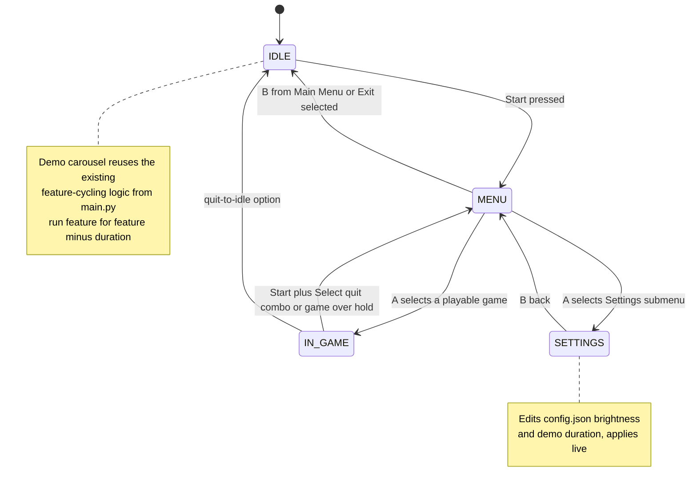
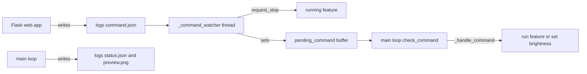
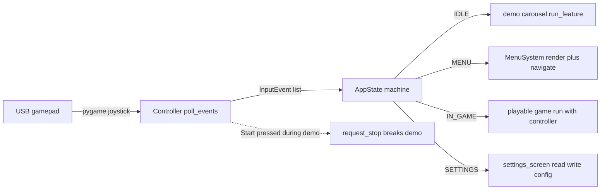
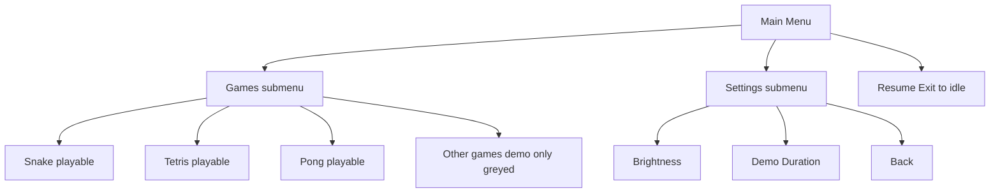
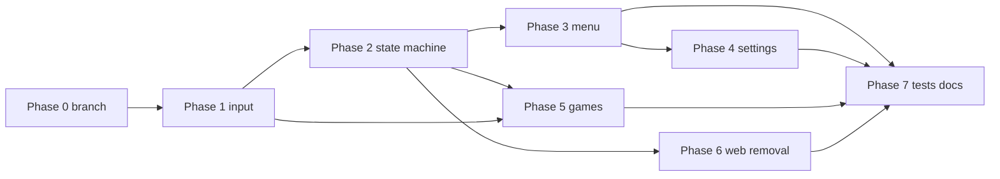

# Controller Overhaul — Design Specification

> **Status:** Design only. This document drives a series of coding subtasks. No
> application code is written here.
>
> **Goal:** Replace the Flask web control panel with a USB-gamepad-driven,
> on-matrix control system. The matrix idles by cycling demos; pressing **Start**
> opens an on-matrix menu to launch playable games, adjust settings, and resume.

---

## 0. Summary of Locked-In Decisions

| Decision | Value |
|----------|-------|
| Control interface | Generic GameCube-style USB gamepad via pygame joystick API |
| Web server | Removed entirely (security) |
| Idle behavior | Reuse existing feature-cycling carousel from `src/main.py` |
| Playable games (this phase) | `snake`, `tetris`, `pong` |
| Other games | Remain demos (design must allow later conversion) |
| New top-level states | `IDLE`, `MENU`, `IN_GAME`, plus `SETTINGS` sub-state |

### Proposed new modules

| Path | Responsibility |
|------|----------------|
| `src/input/__init__.py` | Package init, re-exports the controller API |
| `src/input/controller.py` | pygame joystick wrapper → logical input events |
| `src/input/keyboard_fallback.py` | Keyboard→logical mapping for simulator/headless |
| `src/app_state.py` | Top-level state machine (IDLE/MENU/IN_GAME/SETTINGS) |
| `src/menu/__init__.py` | Menu package init |
| `src/menu/menu_system.py` | Data-driven menu engine + renderer + navigation |
| `src/menu/menu_data.py` | Menu hierarchy definitions (data structures) |
| `src/menu/settings_screen.py` | Settings adjustment screens, config read/write |

`src/main.py` is refactored to instantiate the controller + state machine and
delegate the loop, while keeping its existing matrix init, simulator
registration, config load, WiFi, and boot-screen logic.

---

## 1. High-Level Architecture

### 1.1 New state machine



### 1.2 How it replaces the web command-watcher flow

The current flow is **file-polling driven**:



The new flow is **input-event driven**, in-process, no files:



Key replacements:

- `_command_watcher` thread → **deleted**. Stop signalling now comes from the
  state machine when the user presses **Start** during the idle carousel: the
  state machine calls `request_stop()` (reused from `_shared`) so the running
  demo breaks out within one frame, exactly as the watcher did today.
- `command.json` / `check_command()` / `_handle_command()` / `_pending_command`
  → **deleted**.
- `status.json` / `preview.png` / `display.pid` writers → **deleted** (no web
  consumer remains).
- `play_video` / `play_feature` / `set_brightness` / `show_pixel_art` commands →
  replaced by menu selections and the settings screen.

---

## 2. Input Abstraction Layer — `src/input/controller.py`

### 2.1 Goals

- Wrap the pygame joystick API behind a **logical** button model so neither the
  menu nor the games know about raw axis/button indices.
- Work identically whether driven by a physical gamepad or by keyboard (for the
  simulator and headless test runs).
- Tolerate **device absence and hot-plug** (gamepad unplugged/replugged at
  runtime) without crashing.

### 2.2 Logical inputs

```python
# src/input/controller.py

from enum import Enum

class Button(Enum):
    A = "A"            # confirm / select / primary game action
    B = "B"            # back / cancel / secondary game action
    START = "START"    # open menu (from IDLE) / pause-or-quit (IN_GAME)
    SELECT = "SELECT"  # secondary; combined with START = quit game
    UP = "UP"
    DOWN = "DOWN"
    LEFT = "LEFT"
    RIGHT = "RIGHT"

class EventType(Enum):
    PRESSED = "PRESSED"      # edge: button went down this poll
    RELEASED = "RELEASED"    # edge: button went up this poll
    REPEAT = "REPEAT"        # held-down auto-repeat (for menu scrolling)
```

The four directional `Button`s are a **unified abstraction** over BOTH the
physical D-pad (hat) AND the analog stick. The analog stick is converted to a
direction by a dead-zone threshold (default `0.5`), and diagonal input is
resolved to the dominant axis. This means games and menus only ever reason about
`UP/DOWN/LEFT/RIGHT`.

### 2.3 Event object

```python
from dataclasses import dataclass

@dataclass(frozen=True)
class InputEvent:
    button: Button
    type: EventType
    timestamp: float    # time.monotonic() when generated
```

### 2.4 Public API

```python
class Controller:
    def __init__(self,
                 deadzone: float = 0.5,
                 repeat_delay: float = 0.35,   # s before auto-repeat starts
                 repeat_interval: float = 0.12, # s between repeats while held
                 mapping: "ButtonMapping | None" = None,
                 enable_keyboard_fallback: bool = True):
        ...

    def poll_events(self) -> list[InputEvent]:
        """Pump pygame events once, return logical edge/repeat events since
        the last call. Non-blocking. Also drives hot-plug detection."""

    def is_pressed(self, button: Button) -> bool:
        """Level query: True while the logical button is currently held.
        Games that want polling-style input (e.g. snake direction) use this."""

    def is_connected(self) -> bool:
        """True if a physical joystick is currently attached."""

    def get_direction(self) -> "tuple[int, int] | None":
        """Convenience: current 8-way direction as (dx, dy) or None when
        centered. dx,dy in {-1,0,1}. Built from D-pad + analog + dead-zone."""

    def rumble(self, strength: float = 1.0, duration_ms: int = 200) -> None:
        """Optional haptics if the device supports it; no-op otherwise."""

    def close(self) -> None:
        """Release pygame joystick resources."""
```

`poll_events()` returns **edge events** (PRESSED/RELEASED) plus synthesized
**REPEAT** events for directional buttons, so the menu can scroll smoothly while
a direction is held without the consumer implementing its own timing. Games that
prefer level-polling use `is_pressed()` / `get_direction()` and may ignore the
event list.

### 2.5 Button mapping & calibration

Because the controller is an unbranded GameCube-style pad, raw button/axis
indices are **unknown until tested**. We isolate this in a mapping object loaded
from config:

```python
@dataclass
class ButtonMapping:
    # pygame joystick button index -> logical Button
    buttons: dict[int, Button]
    # hat index used for D-pad (usually 0)
    hat_index: int
    # axis indices for the analog stick
    axis_x: int
    axis_y: int
    invert_y: bool = False
    deadzone: float = 0.5
```

- Default mapping ships in `src/input/controller.py` (a best-guess for common
  generic pads).
- A user override lives in **`config/controller.json`** (new file). If present
  it supersedes the default. This is how a no-brand pad gets calibrated without
  code changes.
- A small **calibration/discovery utility** (CLI, see Roadmap Phase 1) prints
  raw button/axis indices as the user presses each control and writes
  `config/controller.json`. This addresses the biggest unknown for an unbranded
  device.

### 2.6 Hot-plug / absence handling

`poll_events()` consumes pygame's `JOYDEVICEADDED` / `JOYDEVICEREMOVED` events:

- On **removed**: drop the joystick handle, set `is_connected() == False`,
  release all logical buttons (emit RELEASED for any held buttons so games don't
  get stuck moving), and—if `enable_keyboard_fallback`—continue serving keyboard
  events.
- On **added**: (re)open `pygame.joystick.Joystick(0)`, re-apply the mapping.
- If no joystick is present at startup and keyboard fallback is enabled, the
  controller still produces events from the keyboard. On a truly headless Pi
  with no joystick, `poll_events()` simply returns `[]` and the system stays in
  IDLE (demos keep cycling) — graceful degradation, never a crash.

### 2.7 Simulator / headless keyboard fallback — `src/input/keyboard_fallback.py`

The simulator already owns the only pygame window (`src/simulator/matrix.py`),
and that window is what receives keyboard events. The controller's keyboard path
reuses the **same** pygame event queue (`pygame.event.get()` is global), so no
second window is needed.

Default keyboard → logical mapping:

| Key | Logical Button |
|-----|----------------|
| Arrow keys / WASD | UP / DOWN / LEFT / RIGHT |
| `Z` or `Enter` | A |
| `X` or `Backspace` | B |
| `Enter`/`Return` (alt) | START |
| `Right Shift` / `Tab` | SELECT |

Notes:

- The simulator window currently swallows `pygame.event.get()` only for `QUIT`.
  The controller must pump events too; to avoid two consumers draining the same
  queue, the design routes **all** `pygame.event.get()` through the controller's
  `poll_events()`, which re-dispatches `QUIT` handling (or the controller exposes
  a `wants_quit()` flag the main loop checks). This is called out as an
  integration detail for the simulator in the Roadmap.
- Keyboard fallback is force-enabled whenever the real `rgbmatrix` module is
  absent (i.e., simulator mode), and configurable otherwise.

---

## 3. State Machine Module — `src/app_state.py`

### 3.1 States

```python
from enum import Enum

class AppMode(Enum):
    IDLE = "IDLE"          # demo carousel (current default behavior)
    MENU = "MENU"          # on-matrix menu navigation
    IN_GAME = "IN_GAME"    # playable game running with controller
    SETTINGS = "SETTINGS"  # settings adjustment (sub-state of MENU)
```

### 3.2 Transition table

| From | Trigger (logical input) | To | Action |
|------|-------------------------|----|--------|
| IDLE | `START` PRESSED | MENU | `request_stop()` to break running demo; open Main Menu |
| IDLE | (no input) | IDLE | run next feature in carousel for its duration |
| MENU | `A` on a game item | IN_GAME | launch playable game with controller |
| MENU | `A` on Settings item | SETTINGS | push Settings submenu |
| MENU | `A` on Resume/Exit | IDLE | return to demo carousel |
| MENU | `B` at Main Menu root | IDLE | return to demo carousel |
| MENU | `UP/DOWN` | MENU | move selection |
| SETTINGS | `B` | MENU | pop back to Main Menu |
| SETTINGS | `LEFT/RIGHT` | SETTINGS | adjust focused setting value |
| SETTINGS | `A` | SETTINGS | save / toggle focused setting |
| IN_GAME | `START`+`SELECT` (combo) | MENU | quit game, return to menu |
| IN_GAME | game over (hold) | MENU | after death screen, return to menu |

`SETTINGS` is modeled as a sub-state entered from `MENU`; in implementation it is
just a different menu screen pushed onto the menu stack, so it shares the menu
renderer.

### 3.3 Class sketch

```python
# src/app_state.py
class AppStateMachine:
    def __init__(self, matrix, controller, config: dict):
        self.matrix = matrix
        self.controller = controller
        self.config = config
        self.mode = AppMode.IDLE
        self.menu = MenuSystem(matrix, controller, config)
        self._carousel = DemoCarousel(matrix, config)  # wraps existing logic

    def run(self, shutdown_event):
        """Top-level loop, replaces the while-not-shutdown loop in main.main()."""
        while not shutdown_event.is_set():
            if self.mode is AppMode.IDLE:
                self._run_idle(shutdown_event)
            elif self.mode is AppMode.MENU:
                self._run_menu()
            elif self.mode is AppMode.IN_GAME:
                self._run_game()
            elif self.mode is AppMode.SETTINGS:
                self._run_settings()
```

### 3.4 Integration with existing `main.py` and `_shared`

- The **demo carousel** is the current per-feature loop from `main.py` extracted
  into a small `DemoCarousel` helper (or kept as functions in `main.py` and
  called from the state machine). It keeps using `FEATURE_MODULES`,
  `run_feature()`, `clear_stop()`, `should_stop()`, internet checks, schedule
  override, and config reload — **unchanged behavior**.
- While a demo runs, the state machine must still notice a **Start** press. Two
  options, in order of preference:
  1. **Background input thread**: a tiny daemon thread polls
     `controller.poll_events()` at ~20 Hz; on `START` PRESSED it calls
     `request_stop()` (reused from `_shared`) and sets a flag the carousel checks
     on return. This mirrors exactly how `_command_watcher` worked, just sourced
     from the gamepad instead of `command.json`.
  2. Have `run_feature()` accept an optional `on_tick` callback that polls input
     between frames (more invasive; deferred).
  The design adopts option 1: it is the smallest change and reuses the proven
  `request_stop()` mechanism.
- `main.main()` keeps: logging setup, `_register_simulator_modules()`,
  `validate_all()`, signal handlers, `init_matrix()`, boot screen, `ensure_wifi`,
  `load_config()`, `_precache_videos()`. It then constructs `Controller` and
  `AppStateMachine` and calls `state.run(_shutdown)` instead of the inline loop.

---

## 4. Menu / UI System — `src/menu/`

### 4.1 Data-driven menu definition — `src/menu/menu_data.py`

```python
from dataclasses import dataclass, field
from enum import Enum

class ItemAction(Enum):
    LAUNCH_GAME = "LAUNCH_GAME"   # payload = feature name; enters IN_GAME
    OPEN_SUBMENU = "OPEN_SUBMENU" # payload = submenu id
    OPEN_SETTINGS = "OPEN_SETTINGS"
    RESUME_IDLE = "RESUME_IDLE"   # back to demo carousel
    BACK = "BACK"                 # pop submenu

@dataclass
class MenuItem:
    label: str                    # uppercase, renders via _fonts FONT_5X7
    action: ItemAction
    payload: str | None = None
    enabled: bool = True          # greyed-out items (e.g. demo-only games)

@dataclass
class Menu:
    title: str
    items: list[MenuItem] = field(default_factory=list)
```

### 4.2 Menu hierarchy



- **Main Menu**: `Games`, `Settings`, `Resume` (→ IDLE).
- **Games submenu**: `Snake`, `Tetris`, `Pong` (enabled, `LAUNCH_GAME`); other
  games may be listed as disabled/greyed items to telegraph future support.
  Game list is derived from `FEATURE_MODULES` filtered against a
  `PLAYABLE_GAMES = {"snake", "tetris", "pong"}` set so adding a playable game
  later is a one-line change.
- **Settings submenu**: see Section 6.

### 4.3 Rendering on 64x64 — `src/menu/menu_system.py`

Reuses existing helpers — no new font work:

- Text: `src.display._fonts._draw_text(draw, text, x, y, color, scale, spacing)`
  with `FONT_5X7` (5×7 glyphs). At `scale=1`, a char is 6px wide incl. spacing →
  ~10 chars per 64px row. Use `_text_width()` for centering and for deciding when
  to scroll long labels.
- Layout: title row at top (`scale=1`, centered), then a vertical list of items.
  At 7px tall + 2px gap, ~6 items fit below a title. For longer lists, implement
  a **scrolling viewport** (windowed list) with up/down arrow glyphs (`?`/custom)
  when more items exist off-screen.
- **Selection highlight**: draw a filled rounded/!plain rectangle behind the
  selected row (e.g. dim accent color) and render that row's text in a brighter
  color; non-selected rows dimmer. Reuse `_lerp_color`/`_scale_color` from
  `_utils` for the dim/bright variants.
- Long labels that exceed the row width **horizontally scroll** (marquee) only
  while selected, using `_text_width()` to compute the scroll range.
- All drawing builds a single `PIL.Image` then `matrix.SetImage(image)` — the
  same pattern every existing display module uses.

### 4.4 Navigation & loop

```python
class MenuSystem:
    def __init__(self, matrix, controller, config): ...

    def run(self) -> "MenuResult":
        """Render+navigate until the user picks a terminal action.
        Returns a MenuResult describing what to do next:
          - launch game (feature name)
          - open settings (handled internally, may loop)
          - resume idle
        Polls controller.poll_events() each frame; UP/DOWN move selection
        (with REPEAT for held scroll), A selects, B backs out / closes."""
```

- The menu maintains a **stack** of `Menu` screens; `BACK`/`B` pops, selecting a
  submenu pushes. Popping the root returns to IDLE.
- Frame rate ~30 FPS using `time.sleep`; respects `should_stop()` for shutdown
  safety, consistent with other modules.

---

## 5. Game Playability Contract

### 5.1 The signature convention

All current games use `run(matrix, duration=60)`. We extend to:

```python
def run(matrix, duration=60, controller=None):
    """If controller is None -> autonomous DEMO mode (unchanged, used by the
    idle carousel). If controller is not None -> INTERACTIVE mode (player
    drives input via the controller API)."""
```

- **Backward compatible**: the idle carousel calls `run(matrix, duration)` with
  no controller → existing demo AI runs exactly as today. Existing tests that
  call `run(matrix, duration)` keep passing.
- `run_feature()` in `main.py` gains an optional `controller` param it forwards
  only when launching from the menu. Demos still get `controller=None`.
- The `hasattr(module, "run")` discovery in `run_feature()` stays; we just pass
  the extra kwarg. Modules that have not yet been converted simply ignore the
  unexpected behavior because the carousel never passes a controller to them.

### 5.2 Per-game input consumption (this phase)

**Snake** (`src/display/snake.py`):
- Demo: keep `_ai_decide()`.
- Interactive: replace the AI call in the step loop — read
  `controller.get_direction()` (or latest `LEFT/RIGHT/UP/DOWN` PRESSED event) and
  set `self.direction`, rejecting reversals (reuse existing `_opposite` guard).
  Everything else (collision, food, draw, death animation) is unchanged.
- Exit: `START`+`SELECT` combo, or after death animation return control to menu.

**Tetris** (`src/display/tetris.py`):
- Interactive controls: `LEFT/RIGHT` move piece, `DOWN` soft-drop, `A` rotate CW,
  `B` rotate CCW, `UP` (or `A` double) hard-drop, `START`+`SELECT` quit.
- Use **edge events** (PRESSED) for rotate/hard-drop and **REPEAT** for
  left/right/soft-drop so holding a direction auto-shifts at a sane rate (the
  controller's repeat timing already provides this).

**Pong** (`src/display/pong.py`):
- Two-player-friendly but single-player this phase: player paddle follows
  `UP/DOWN` (level-polled via `is_pressed()`); opponent stays AI.
- Exit: `START`+`SELECT`.

### 5.3 How a game returns to the menu

- Each interactive game loop checks, every frame:
  - `should_stop()` → shutdown path (unchanged, for process shutdown).
  - A **quit condition**: the `controller` reports `START` and `SELECT` both
    held simultaneously (a deliberate combo to avoid accidental quits). When
    detected, the game's `run()` returns normally.
- A returned `run()` hands control back to the state machine, which transitions
  `IN_GAME → MENU` and re-renders the Games submenu.
- Game-over also returns to MENU: after the existing death/game-over animation,
  interactive `run()` returns instead of looping a new round (demo mode keeps
  looping rounds as it does today).

### 5.4 Shared helper to keep games thin

To avoid duplicating quit-combo logic in every game, add a tiny helper
(proposed `src/input/controller.py::wants_quit(controller)`) returning `True`
when `START`+`SELECT` are both held. Each interactive game calls it once per
frame:

```python
from src.input.controller import wants_quit

def run(matrix, duration=60, controller=None):
    interactive = controller is not None
    ...
    while ...:
        if should_stop():
            break
        if interactive and wants_quit(controller):
            break
        if interactive:
            controller.poll_events()          # pump input each frame
            # consume direction / buttons
        else:
            ...  # existing AI path
```

### 5.5 Converting demo-only games later (forward compatibility)

A future game becomes playable by:
1. Adding its name to `PLAYABLE_GAMES` in `src/menu/menu_data.py`.
2. Extending its `run()` to accept `controller=None` and branching on it.
No menu, state-machine, or controller changes are required — the contract is
stable.

---

## 6. Settings via Controller — `src/menu/settings_screen.py`

With no web UI, on-device settings edit `config/config.json` directly. Scope is
kept intentionally small for this phase.

### 6.1 Adjustable settings

| Setting | config.json key | Range / step | Apply |
|---------|-----------------|--------------|-------|
| Brightness | `matrix_hardware.brightness` | 10–100, step 5 | Live: set `matrix.brightness` immediately; also persist |
| Demo duration | `display_duration` | 10–300 s, step 5 | Persist; takes effect next carousel cycle |
| (optional) Night-mode toggle | `schedule.enabled` (in `schedule.json`) | on/off | Persist |

### 6.2 Interaction model

- Settings submenu lists each setting as a row showing `LABEL: value`.
- `UP/DOWN` move between settings; `LEFT/RIGHT` decrement/increment the focused
  value by its step (clamped to range); `A` confirms/persists; `B` goes back
  (auto-persisting any pending change).
- Live preview: brightness changes apply to `matrix.brightness` instantly so the
  user sees the effect while adjusting.

### 6.3 Read/write strategy

```python
# src/menu/settings_screen.py
def load_settings(config_path) -> dict          # read config.json (reuse load_config)
def save_settings(config_path, updates: dict)   # atomic write-back
```

- **Atomic write**: write to `config/config.json.tmp` then `os.replace()` so a
  crash mid-write cannot corrupt the config (the existing `load_config()` already
  guards against corruption with a default fallback, but atomic write avoids
  triggering it).
- Only the touched keys are updated; the rest of `config.json` (sequence,
  hardware block, etc.) is preserved by read-modify-write.
- The carousel already reloads config between cycles, so duration changes are
  picked up automatically with no extra plumbing.

---

## 7. Web Removal Checklist

> Distinguish **web-only** code (delete) from **shared/runtime** code (keep).

### 7.1 Delete entirely

- `src/web/` — whole directory:
  - `src/web/__init__.py`, `src/web/app.py`
  - `src/web/static/style.css`
  - `src/web/templates/*.html` (all 20 templates: base, login, dashboard,
    features, settings, logs, change_password, api_docs, countdown, github_stats,
    living_world, messages, pixel_editor, qr, slideshow, stocks, wifi, wireframe,
    youtube)
- `services/led-matrix-web.service`
- `tests/test_web.py`
- `config/web.json` (web credentials/settings — only consumed by the web app)
- `config/wireframe.json`, `config/qr.json`, `config/messages.json`,
  `config/countdown.json`, `config/github_stats.json`, `config/stocks.json` —
  **KEEP**: these are consumed by display modules, not the web app. (Listed here
  explicitly so they are NOT mistakenly deleted.)

### 7.2 Modify `src/main.py` (remove web-coupled paths)

Delete these functions / variables / call sites:
- `write_status()` and its `_start_time` usage.
- `_save_preview()` (PNG preview for web).
- `write_pid()` and `logs/display.pid`.
- `COMMAND_PATH`, `_pending_command`, `_pending_lock`.
- `check_command()`, `_command_watcher()`, the watcher thread start.
- `_handle_command()` and its command types (`play_video`, `play_feature`,
  `set_brightness`, `show_pixel_art`).
- `_show_pixel_art()` (reads `logs/pixel_art.json` from the web pixel editor).
- `_matrix_ref` / `_self_module._matrix_ref` (only used for web preview).
- All `write_status(...)` calls inside the main loop.

Keep (NOT web-only):
- `handle_play_video()` core video logic — **but** it currently calls
  `check_command()`; refactor so video playback respects `should_stop()` instead.
  Video can later be a menu-launched feature. (Mark as a follow-up; for this
  phase video stays a carousel demo and the command-interrupt block is removed.)
- `_check_internet()`, `_run_feature_with_watchdog()`, `init_matrix()`,
  `_load_hardware_config()`, `_register_simulator_modules()`, `load_config()`,
  `_check_schedule()`, `_precache_videos()`, `ensure_wifi()`, signal handlers,
  `run_feature()` (extended per §5.1).
- The main display loop body becomes the `DemoCarousel` used by IDLE.

### 7.3 `requirements.txt`

- Remove the **Web control panel** block:
  - `Flask>=3.0.0`
  - `flask-sock>=0.7.0`
- Keep `pygame` (now a **runtime** dependency for the controller, not just the
  simulator — update its comment to reflect that and consider removing the
  platform marker so it installs on the Pi too, since joystick input needs it).

### 7.4 `scripts/`

- `scripts/start.sh`:
  - Remove the `web)` case and the `web` usage comment.
  - Change the dependency-presence check from `import flask` to a kept
    dependency (e.g. `import pygame` or `import PIL`).
- `scripts/install.sh`: remove web-service copy/sed/enable block (lines ~307–318)
  and the web-service lines in the post-install echo (lines ~369–376).
- `scripts/reinstall.sh`: remove web-service stop/disable/rm and status/journal
  lines (~68, 72, 79, 120, 134–135, 142).
- `scripts/uninstall.sh`: remove web-service stop/disable/rm (~74, 84, 89) and the
  "what was removed" mention (~192).
- `scripts/troubleshoot.sh`: remove the web-service installed/enabled/running
  checks (~36–40, 54–59, 74–79).

### 7.5 `services/`

- Confirm `led-matrix.service` (main display) is unchanged and remains.
- `led-matrix-updater.service` / `.timer`: keep, but verify the updater's
  "restart both services" step no longer references the web service (see §7.6).

### 7.6 `src/updater/auto_update.py`

- Search for and remove any `systemctl restart led-matrix-web` step so the
  auto-updater doesn't try to restart a deleted service. (Flagged for inspection
  in the web-removal subtask.)

### 7.7 `README.md`

- Remove/replace: web control panel feature row and the entire "web interface"
  section (port 5000, credentials, dashboard/features/settings tables, line ~74,
  91), `web.json` mention (~180), `led-matrix-web.service` references (~199, 279),
  `src/web/` tree entry (~211–212), "Start the web control panel on port 5000"
  (~153), "Restarts both the display service and the web panel" (~358–359),
  test-count description that says "web endpoints" (~347), and the intro line
  "runs unattended from boot with a web control panel" (~3).
- Add a new **Controls** section describing the gamepad UX (Start → menu, D-pad
  navigate, A select, B back, Start+Select quit game) and the simulator keyboard
  fallback.

### 7.8 Logs artifacts (no longer produced)

- `logs/command.json`, `logs/status.json`, `logs/preview.png`,
  `logs/display.pid`, `logs/pixel_art.json` — no code writes/reads them after the
  removal. No deletion needed (gitignored runtime files), but documented as dead.

---

## 8. Phased Implementation Roadmap

Dependencies are noted as `(needs: …)`.

1. **Phase 0 — Branch & scaffolding**
   - Create feature branch `feature/controller-overhaul`.
   - Add empty `src/input/`, `src/menu/` packages.
   - `(needs: none)`

2. **Phase 1 — Input abstraction layer**
   - Implement `src/input/controller.py` (`Controller`, `Button`, `EventType`,
     `InputEvent`, `ButtonMapping`, `wants_quit`).
   - Implement `src/input/keyboard_fallback.py`.
   - Add controller calibration CLI (e.g. `dev.py calibrate-controller` or
     `scripts/calibrate_controller.py`) writing `config/controller.json`.
   - Unit tests with a mocked pygame joystick + keyboard events.
   - `(needs: Phase 0)`

3. **Phase 2 — State machine**
   - Implement `src/app_state.py` (`AppMode`, `AppStateMachine`, `DemoCarousel`).
   - Refactor `src/main.py` to construct `Controller` + `AppStateMachine` and
     delegate the loop; extract carousel logic.
   - Background input thread that calls `request_stop()` on Start during IDLE.
   - `(needs: Phase 1)`

4. **Phase 3 — Menu / UI system**
   - Implement `src/menu/menu_data.py`, `src/menu/menu_system.py`.
   - Render via `_fonts` / `_utils`; selection highlight; scrolling viewport.
   - Wire MENU state to the state machine; Main/Games/Settings hierarchy.
   - `(needs: Phase 1, Phase 2)`

5. **Phase 4 — Settings screen**
   - Implement `src/menu/settings_screen.py` (brightness, demo duration; atomic
     config write-back; live brightness apply).
   - `(needs: Phase 3)`

6. **Phase 5 — Playable games**
   - Extend `run(matrix, duration, controller=None)` for `snake`, `tetris`,
     `pong`; wire IN_GAME launch + quit-combo return.
   - Verify demo mode (controller=None) unchanged.
   - `(needs: Phase 1, Phase 2; benefits from Phase 3 for launch UX)`

7. **Phase 6 — Web removal**
   - Execute the §7 checklist (delete `src/web/`, service, tests, web-only
     config; strip `main.py` web paths; clean scripts/requirements/README;
     fix updater).
   - `(needs: Phase 2 — main.py refactor must already not depend on web paths)`

8. **Phase 7 — Tests & docs**
   - New tests: `tests/test_controller.py`, `tests/test_app_state.py`,
     `tests/test_menu.py`, interactive-mode game tests (controller-injected).
   - Update `tests/test_integration.py` to drive the state machine instead of
     command files; ensure `tests/test_display_modules.py` still calls
     `run(matrix, duration)` (demo mode).
   - Update `README.md` Controls section.
   - `(needs: all prior phases)`



---

## 9. Risks & Open Questions

1. **Unknown button/axis mapping for the no-brand pad.**
   - Risk: default mapping may not match the GameCube-style clone.
   - Mitigation: ship a **calibration CLI** (Phase 1) that records raw indices
     into `config/controller.json`; `Controller` loads overrides at startup.

2. **pygame joystick on a headless Pi.**
   - pygame's joystick subsystem typically needs an initialized video subsystem.
     On a headless Pi we likely must set `SDL_VIDEODRIVER=dummy` and call
     `pygame.display.init()` (or use SDL's event/joystick init without a window).
     Open question: confirm joystick events fire under `dummy` driver; if not,
     evaluate reading `/dev/input/js0` via `evdev` as a fallback backend behind
     the same `Controller` API.
   - Action: validate early in Phase 1 on real Pi hardware.

3. **Event-queue ownership in the simulator.**
   - Both the simulator window and the controller want `pygame.event.get()`.
     Design routes all event pumping through `Controller.poll_events()`, which
     must also surface `QUIT`. Confirm the simulator's `render()` no longer
     drains `QUIT` independently to avoid lost events.

4. **Input latency.**
   - Polling at frame rate (~30–60 Hz) should keep latency <33 ms. Tetris/pong
     need responsive input; verify the per-frame `poll_events()` cost is
     negligible on the Pi.

5. **Quit-combo ergonomics.**
   - `START`+`SELECT` chosen to prevent accidental quits, but clones may lack a
     real Select. Open question: confirm the pad exposes a usable Select; if not,
     fall back to "hold START for 1.5 s" as the quit gesture (configurable).

6. **Background input thread vs. `request_stop()`.**
   - Reusing `_shared._stop_event` for both "demo finished" and "user opened
     menu" means the carousel must distinguish them. Mitigation: a separate
     `menu_requested` flag set alongside `request_stop()`; the carousel checks it
     on return to decide IDLE→MENU vs. next feature.

7. **Video player interaction.**
   - `handle_play_video()` currently uses the command file to interrupt. After
     removal it must honor `should_stop()`/menu-request instead. Low risk but
     must be handled in the web-removal phase, not silently dropped.

8. **drop_privileges / permissions.**
   - Reading `/dev/input/js0` may require the service user to be in the `input`
     group. Note for install.sh if the evdev fallback is adopted.

---

## Appendix A — Files Touched (quick index)

| Action | Path |
|--------|------|
| New | `src/input/__init__.py`, `src/input/controller.py`, `src/input/keyboard_fallback.py` |
| New | `src/app_state.py` |
| New | `src/menu/__init__.py`, `src/menu/menu_system.py`, `src/menu/menu_data.py`, `src/menu/settings_screen.py` |
| New | `config/controller.json` (generated by calibration) |
| New | calibration CLI (`scripts/calibrate_controller.py` or `dev.py` subcommand) |
| New tests | `tests/test_controller.py`, `tests/test_app_state.py`, `tests/test_menu.py` |
| Modify | `src/main.py` (strip web, delegate to state machine, extend `run_feature`) |
| Modify | `src/display/snake.py`, `tetris.py`, `pong.py` (interactive `run`) |
| Modify | `requirements.txt`, `scripts/start.sh`, `install.sh`, `reinstall.sh`, `uninstall.sh`, `troubleshoot.sh`, `README.md`, `src/updater/auto_update.py`, `src/simulator/matrix.py` (event ownership) |
| Delete | `src/web/` (all), `services/led-matrix-web.service`, `tests/test_web.py`, `config/web.json` |

---

## Implementation Status / Completion

This section records what was **actually built** across the implementation
phases, so this spec reflects reality. Unless noted as a deviation, the system
matches the design above.

### Delivered

- **Input layer** (`src/input/`): `Controller`, `Button`, `EventType`,
  `InputEvent`, `ButtonMapping`, `wants_quit`, `default_mapping` /
  `load_mapping` / `save_mapping`. The `Controller` is the single owner of the
  pygame event queue (coexisting with the simulator's window-close). A
  calibration CLI (`python -m src.input.controller calibrate`) writes
  `config/controller.json`; a **keyboard fallback** (`keyboard_fallback.py`)
  lets the simulator be driven with the keyboard (arrows/WASD, Z=A, X=B,
  Enter=Start, Tab=Select).
- **State machine** (`src/app_state.py`): `AppMode` (IDLE / MENU / IN_GAME),
  `AppStateMachine`, `DemoCarousel` (the legacy demo loop extracted by
  delegation), and the `MenuController` / `MenuResult` seam. A background input
  thread watches for START during IDLE and `request_stop()`s the demo (the
  in-process replacement for the deleted web command-watcher).
- **Menu + Settings** (`src/menu/`): a data-driven menu engine
  (`menu_system.py` + `menu_data.py`) with a scrolling viewport, plus an inline
  `SettingsScreen` that adjusts **brightness** and **demo duration**, applies
  brightness live to the matrix, and persists changes atomically (deep-merge)
  to `config/config.json`.
- **Playable games**: `snake`, `tetris`, `pong` each expose
  `run(matrix, duration=60, controller=None)` — autonomous **demo** when
  `controller is None`, **interactive** when a controller is supplied.
  `PLAYABLE_GAMES = {"snake", "tetris", "pong"}` is the single source of truth
  the Games submenu is generated from.
- **Web server FULLY REMOVED**: `src/web/`, `services/led-matrix-web.service`,
  `tests/test_web.py`, and `config/web.json` are deleted; Flask / flask-sock are
  gone from `requirements.txt`; scripts, the README, and the updater are
  de-webbed. Control is entirely on-device via the gamepad + on-matrix menu.
- **Tests**: `tests/test_input.py`, `tests/test_app_state.py`,
  `tests/test_menu.py`, `tests/test_playable_games.py`, and an end-to-end
  controller-flow suite in `tests/test_integration.py`
  (IDLE → MENU → IN_GAME → MENU → Settings → IDLE → shutdown) driving the **real**
  state machine, **real** `MenuSystem`, and a **real** game `run()` with a
  scripted, headless fake controller.

### Deviations from the original design

1. **Settings is handled *inline*, not as a separate top-level mode.** The
   design contemplated a `SETTINGS` app mode; in practice the `MenuSystem` runs
   `SettingsScreen` as a *pushed screen* and pops straight back to the menu, so
   `AppMode` has only IDLE / MENU / IN_GAME. The state machine still treats a
   `MenuResult.OPEN_SETTINGS` as "stay in MENU", so the seam exists, but the
   real menu never needs to return it (it only returns `launch_game` / `resume`
   / `quit`). This is the cleaner UX and keeps the top-level mode set minimal.
2. **`pygame` is now a runtime dependency.** Previously simulator-only, pygame
   was promoted to a runtime dep because the controller/input layer uses
   `pygame.joystick` + the event queue on the device as well.
3. **`PlaceholderMenu` is kept as a fallback.** The real `MenuSystem` is the
   default, but `AppStateMachine._default_menu()` falls back to the
   dependency-light `PlaceholderMenu` if `src.menu` cannot be imported (e.g. a
   partial install), so the app is never left without a menu.
4. **Calibration CLI lives in the input module.** Rather than a separate
   `scripts/calibrate_controller.py`, calibration is invoked as
   `python -m src.input.controller calibrate`.
5. **Test file naming.** Controller tests live in `tests/test_input.py` (the
   spec sketched `tests/test_controller.py`); functionality is equivalent.

### Known unrelated test failure

`tests/test_living_world.py::TestBowCrafting::test_bow_crafted_on_hunt` fails on
this branch (`AssertionError: 'walking' == 'hunting'`). This is a **pre-existing
bug in the villager-AI / living-world simulation** that this overhaul never
touched (no `src/display/living_world/` source was modified by any phase). It is
out of scope for the controller-UI work and is left as-is.