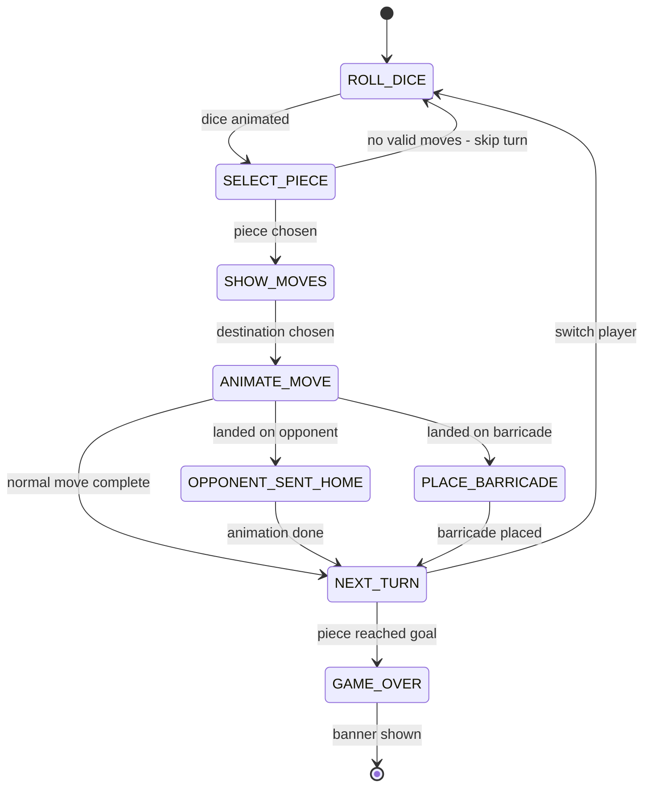

# Barricade (Malefiz) - LED Matrix Game Architecture

## Overview

Barricade (also known as Malefiz) adapted for a 64×64 LED matrix. Players race pieces from bottom to top while placing barricades to block opponents. Supports both AI-vs-AI demo mode and player-vs-AI interactive mode.

## Game Rules (Simplified for 2-Player)

1. **Objective**: First player to move any piece to the GOAL node at the top wins
2. **Dice**: Each turn rolls 1–6; the piece must move exactly that many steps
3. **Movement**: Pieces move along connected path nodes (no jumping over barricades or other pieces)
4. **Barricade capture**: Landing on a barricade removes it; the player must then place it on any empty path node (except home rows or goal)
5. **Opponent capture**: Landing on an opponent sends them back to their home base
6. **Blocked paths**: If no piece can move the full dice count, the turn is skipped

## Board Layout (64×64 pixels)

```
Board Grid: 9 columns x 9 rows of path nodes
Node spacing: 7px horizontal, 6px vertical
Piece size: 2×2 pixels
Barricade: 2×2 white/gray pixels
Path connections: 1px dim lines
```

### Visual Layout (schematic)

```
Row 0:            [GOAL]              <- single node, top center
Row 1:       O----O----O----O         <- 4 connected nodes
Row 2:    O----O----O----O----O       <- 5 connected nodes  
Row 3:       O----O----O----O         <- 4 connected nodes
Row 4:    O----O----O----O----O       <- 5 connected (full width)
Row 5:       O----O----O----O         <- 4 connected nodes
Row 6:    O----O----O----O----O       <- 5 connected nodes
Row 7:       O----O----O----O         <- 4 connected nodes
Row 8:    O----O----O----O----O       <- 5 connected (bottom paths)
           |     |     |     |
Home L:   [P][P][P]         [P][P][P]  <- 3 pieces per player
```

### Pixel Coordinates

| Element | Size | Notes |
|---------|------|-------|
| Board offset | x=3, y=2 | Centers the grid |
| Node-to-node horizontal | 7px | Fits 9 columns in ~60px |
| Node-to-node vertical | 6px | Fits 9 rows + home in ~62px |
| Piece | 2×2 px | Colored square on node |
| Barricade | 2×2 px | White square on node |
| Path line | 1px | Dim gray connecting nodes |
| Dice display | top-right corner | 3×5 digit, shown briefly |
| Turn indicator | 1px colored dot | Top-left, player's color |

### Color Palette

| Element | Color | RGB |
|---------|-------|-----|
| Background | Black | (0, 0, 0) |
| Path lines | Dim blue-gray | (20, 20, 40) |
| Path nodes (empty) | Dim dot | (30, 30, 50) |
| Player 1 pieces | Cyan | (0, 200, 255) |
| Player 2 pieces | Orange-red | (255, 100, 40) |
| Barricade | White | (200, 200, 200) |
| Goal node | Gold pulse | (255, 215, 0) |
| Selected/highlight | Bright green | (0, 255, 100) |
| Valid move overlay | Dim green blink | (0, 80, 40) |
| Dice number | White | (255, 255, 255) |

## Game State Machine



### Turn Phases

1. **ROLL_DICE** — Brief dice animation (0.5s), show result
2. **SELECT_PIECE** — If multiple pieces can legally move, highlight selectable ones
3. **SHOW_MOVES** — Highlight all valid destination nodes for chosen piece
4. **ANIMATE_MOVE** — Piece slides node-by-node toward destination (0.1s per hop)
5. **PLACE_BARRICADE** — Cursor over board, player picks empty node for captured barricade
6. **NEXT_TURN** — Check win condition, swap active player

## Board Data Structure

```python
# Board represented as a graph
class BarricadeBoard:
    nodes: list[tuple[int, int]]        # pixel positions of each node
    edges: dict[int, list[int]]         # adjacency list (node_index -> neighbors)
    barricades: set[int]                # node indices with barricades
    pieces: dict[int, list[int]]        # player_id -> list of node indices
    home_nodes: dict[int, list[int]]    # player_id -> home node indices
    goal_node: int                      # index of the goal node
```

The board topology is **hardcoded** as a graph with ~40 path nodes. Vertical connections create the pyramid shape with bottleneck passages that barricades can block effectively.

## AI Design (Demo Mode)

Both players run AI. The heuristic evaluates each legal move by:

1. **Forward progress** (+3 per row advanced toward goal)
2. **Barricade capture** (+5 if capturing unblocks a direct path)
3. **Opponent capture** (+4 if sending opponent back)
4. **Barricade placement** (place to block opponent's most-advanced piece)
5. **Risk penalty** (-2 if moving into a position easily captured next turn)

The AI adds small randomness (±1) to scores so demo games vary. Decision delay ~0.3s for readability.

## Interactive Mode - Controller Mapping

| Input | Action |
|-------|--------|
| D-pad UP/DOWN | Cycle through selectable pieces or valid destinations |
| D-pad LEFT/RIGHT | Navigate barricade placement cursor |
| A button | Confirm selection (piece, destination, or barricade placement) |
| B button | Cancel / go back to previous phase |
| Start+Select | Quit to menu |

### Cursor Behavior

- A blinking highlight (green) shows the current selection
- Valid options pulse dimly; the active selection pulses brightly
- D-pad cycles through valid options only (skip invalid nodes)

## Demo Mode Behavior

- AI vs AI at a readable pace (~1.5s per turn total)
- Auto-restarts when a game ends (brief "P1 WINS" banner)
- Runs until `duration` elapses or `should_stop()` fires
- Initial barricade positions randomized each game for variety

## Module Structure

```
src/display/barricade.py    <- single file (follows project convention)
```

### Key Classes/Functions

| Name | Purpose |
|------|---------|
| `BarricadeGame` | Full game state, board, pieces, logic |
| `BarricadeGame.roll_dice()` | Generate 1-6 roll |
| `BarricadeGame.get_valid_moves(piece_idx, roll)` | BFS for reachable nodes at exact distance |
| `BarricadeGame.move_piece(piece_idx, dest)` | Execute move, handle captures |
| `BarricadeGame.get_barricade_placements()` | Valid nodes for placing a captured barricade |
| `BarricadeGame.check_winner()` | Check if any piece is on goal |
| `BarricadeGame.draw(matrix)` | Render full board state to PIL Image |
| `_run_demo(matrix, duration, start_time)` | AI vs AI game loop |
| `_run_interactive(matrix, controller, start_time)` | Player vs AI loop |
| `run(matrix, duration=60, controller=None)` | Entry point (matches project pattern) |

### Path-Finding (Valid Moves)

Movement uses **BFS with exact distance**:
- From the piece's current node, explore all paths of exactly `dice_roll` steps
- Cannot pass through barricades or other pieces (but CAN land on them at exactly the right step count)
- Landing on a barricade at the final step = capture
- Landing on an opponent at the final step = send home

## Integration Points

1. **Feature registry** — Add `"barricade": "src.display.barricade"` to [`src/feature_registry.py`](src/feature_registry.py:9)
2. **Imports** — Use `_shared.should_stop`, `interruptible_sleep`, `read_direction`, `safe_rumble`, `show_banner`
3. **Utils** — Use `_draw_digit` for dice display, `_scale_color` for pulse effects
4. **Fonts** — Use `_fonts._draw_text` for winner banner text
5. **Run signature** — `run(matrix, duration=60, controller=None)` matching all other games

## Initial Barricade Placement

Each game starts with 9 barricades placed on predetermined positions (middle rows of the board), ensuring:
- No player's immediate exit path is blocked on turn 1
- Multiple bottleneck passages have barricades creating strategic choices
- Positions are shuffled slightly each game for variety (demo mode)

## Animation Details

| Animation | Duration | Description |
|-----------|----------|-------------|
| Dice roll | 0.5s | Flash random numbers then settle |
| Piece move | 0.1s/hop | Slide through intermediate nodes |
| Barricade capture | 0.2s | Flash white then disappear |
| Opponent sent home | 0.3s | Flash red then teleport to home |
| Goal reached | 1.0s | Radial pulse from goal node |
| Turn indicator | continuous | Gentle pulse of active player color |

## File Size Estimate

~450-550 lines (comparable to [`pong.py`](src/display/pong.py) at 501 lines and [`tetris.py`](src/display/tetris.py) at 804 lines).
