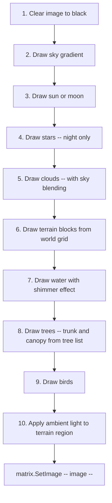
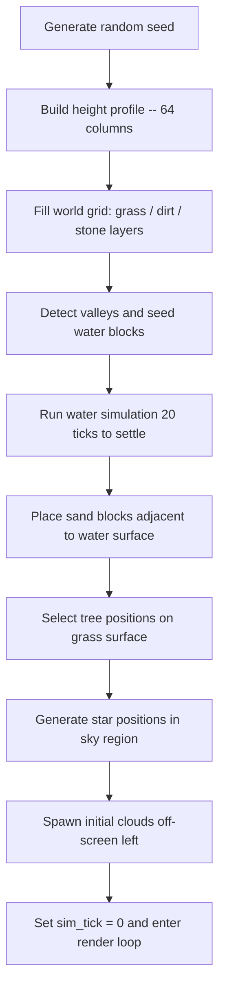

# Living World -- Architecture Document

Target file: `src/display/living_world.py`

---

## 1. Module Skeleton and Conventions

Follows the established display module pattern observed in [`fire.py`](src/display/fire.py), [`lava_lamp.py`](src/display/lava_lamp.py), [`game_of_life.py`](src/display/game_of_life.py), and [`terrain_ball.py`](src/display/terrain_ball.py).

```python
#!/usr/bin/env python3
"""Living World -- a breathing 2D pixel voxel simulation for 64x64 LED matrix."""

import time
import math
import random
import logging
from PIL import Image
from display._shared import should_stop

logger = logging.getLogger(__name__)

WIDTH, HEIGHT = 64, 64
FRAME_INTERVAL = 1.0 / 18          # ~18 FPS target
DAY_CYCLE_SECONDS = 900.0          # 15 minutes for one full day/night cycle

def run(matrix, duration=900):
    # ... init world state ...
    start_time = time.time()
    try:
        while time.time() - start_time < duration and not should_stop():
            frame_start = time.time()
            # ... tick + render ...
            elapsed = time.time() - frame_start
            sleep_time = FRAME_INTERVAL - elapsed
            if sleep_time > 0:
                time.sleep(sleep_time)
    except Exception as e:
        logger.error("Error in living_world: %s", e, exc_info=True)
    finally:
        try:
            matrix.Clear()
        except Exception:
            pass
```

Key differences from simpler modules:

| Concern | Approach |
|---------|----------|
| Stop signal | Check [`should_stop()`](src/display/_shared.py:22) every frame |
| Default duration | 900 s -- one full day/night cycle |
| Simulation state | Multiple interacting subsystems with different tick rates |
| Rendering | Layered compositing -- sky, terrain, water, trees, entities |

---

## 2. World Data Model

### 2.1 Block Grid

A 2D list indexed as `world[y][x]` where `y=0` is the top of the screen and `y=63` is the bottom. Each cell holds an integer block type ID.

```
world = [[AIR] * WIDTH for _ in range(HEIGHT)]
```

### 2.2 Entity Lists

Mutable entities live outside the grid in plain Python lists:

```
clouds:  list[Cloud]      # 2-4 active cloud objects
birds:   list[Bird]       # 0-3 active bird objects
trees:   list[Tree]       # 3-6 tree objects with growth state
```

### 2.3 Simulation Clock

A single `sim_tick` counter incremented each frame drives all subsystems. Different systems advance at different tick multiples -- see section 9.

### 2.4 Day/Night Phase

A float `day_phase` in `[0.0, 1.0)` derived from wall-clock elapsed time:

```
day_phase = ((time.time() - start_time) % DAY_CYCLE_SECONDS) / DAY_CYCLE_SECONDS
```

---

## 3. Terrain Generation Algorithm

Terrain is generated once at startup by producing a **height profile** -- one integer per column -- then filling blocks downward.

### 3.1 Height Profile via Layered Sine Waves

```
height[x] = BASE_GROUND + sum(amp_i * sin(freq_i * x + phase_i))   for i in octaves
```

Parameters:

| Constant | Value | Purpose |
|----------|-------|---------|
| `BASE_GROUND` | 42 | Average surface row -- about 2/3 down the display |
| Octave count | 3 | Enough complexity without chaos |
| Octave 1 | amp=5, freq=0.08 | Broad hills and valleys |
| Octave 2 | amp=2, freq=0.20 | Medium undulation |
| Octave 3 | amp=1, freq=0.45 | Fine texture |
| Phase offsets | random per octave | Unique worlds each run |

The result is clamped to `[30, 52]` so there is always visible sky and underground.

### 3.2 Layer Fill

For each column `x` with surface at `surface_y = height[x]`:

| Row range | Block type |
|-----------|------------|
| `0` to `surface_y - 1` | `AIR` |
| `surface_y` | `GRASS` |
| `surface_y + 1` to `surface_y + 4` | `DIRT` |
| `surface_y + 5` to `63` | `STONE` |

### 3.3 Depression Detection for Water Seeding

After terrain generation, scan the height profile for **valleys** -- local minima where `height[x] > height[x-1]` and `height[x] > height[x+1]` do NOT hold, i.e., the column is lower than both neighbors. For each detected valley, flood the depression with water up to the height of the lower surrounding ridge, capped at 4 blocks deep. This creates 1-3 natural ponds/lakes.

---

## 4. Material / Block System

### 4.1 Block Type Constants

```python
AIR   = 0
GRASS = 1
DIRT  = 2
STONE = 3
WATER = 4
WOOD  = 5
LEAF  = 6
SAND  = 7
```

### 4.2 Base Color Palette -- Daytime

Bold, saturated colors optimized for LED visibility:

| Block | RGB | Hex | Notes |
|-------|-----|-----|-------|
| `AIR` | -- | -- | Transparent, sky shows through |
| `GRASS` | `(30, 180, 30)` | `#1EB41E` | Bright green surface |
| `DIRT` | `(120, 72, 36)` | `#784824` | Warm brown |
| `STONE` | `(90, 90, 100)` | `#5A5A64` | Cool grey with blue tint |
| `WATER` | `(25, 80, 200)` | `#1950C8` | Deep saturated blue |
| `WOOD` | `(100, 60, 25)` | `#643C19` | Dark brown |
| `LEAF` | `(15, 140, 20)` | `#0F8C14` | Rich green, distinct from grass |
| `SAND` | `(210, 190, 100)` | `#D2BE64` | Warm yellow -- lines pond shores |

### 4.3 Day/Night Color Modulation

All block colors are multiplied by an **ambient light factor** derived from `day_phase`. See section 6.3 for the factor curve. At full night, the factor drops to `0.15`, making the world dim but not black.

Water gets a special additive moonlight shimmer at night: occasional pixels brightened by `(10, 15, 30)`.

---

## 5. Water Simulation

### 5.1 Cellular Automata Rules

Water simulation runs every **4 frames** -- roughly 4-5 times per second. Each tick scans the grid **bottom-to-top, left-to-right** to let water settle naturally.

For each cell `(x, y)` that contains `WATER`:

```
1. IF world[y+1][x] == AIR:         -> move water down      (gravity)
2. ELIF world[y+1][x] == WATER:     -> try horizontal spread
   a. Pick random direction (left or right first)
   b. IF world[y][x+dir] == AIR:    -> move water sideways
   c. ELIF world[y][x-dir] == AIR:  -> move water other way
3. ELSE:                             -> water stays put       (resting)
```

### 5.2 Water Pressure -- Simple Level Equalization

To prevent water piling up on one side of a pond, add a second pass: for each surface water cell -- a water cell with air above -- check if adjacent columns have lower water surfaces and flow toward them. This creates flat pond surfaces over several ticks.

### 5.3 Water Rendering Enhancements

- **Shimmer:** Every frame, offset water color slightly based on `sin(x * 0.5 + sim_tick * 0.15)` to create a subtle ripple effect. The blue channel shifts +/- 15.
- **Surface highlight:** The topmost water cell in each column gets a brighter variant `(40, 100, 220)` to suggest a reflective surface.
- **Transparency:** Water cells that are only 1 block deep blend 50% with the block below, achieved by averaging the two RGB tuples.

---

## 6. Sky and Weather System

### 6.1 Day/Night Cycle Phases

The 15-minute cycle divides into four phases based on `day_phase`:

```
  0.0          0.125        0.5          0.625        1.0
   |-- DAWN ---|--- DAY ----|-- DUSK ----|-- NIGHT ---|
```

| Phase | Range | Duration |
|-------|-------|----------|
| Dawn | `0.000 -- 0.125` | ~112 s |
| Day | `0.125 -- 0.500` | ~338 s |
| Dusk | `0.500 -- 0.625` | ~112 s |
| Night | `0.625 -- 1.000` | ~338 s |

### 6.2 Sky Gradient

The sky is rendered as a vertical gradient from `sky_top` color to `sky_bottom` color. For each row `y` in the sky region, linearly interpolate between top and bottom.

Sky palette keyframes -- interpolate smoothly between adjacent phases:

| Phase | Top RGB | Bottom RGB |
|-------|---------|------------|
| Dawn start | `(20, 10, 40)` | `(180, 80, 40)` |
| Dawn end / Day start | `(30, 100, 220)` | `(100, 180, 255)` |
| Day | `(30, 100, 220)` | `(100, 180, 255)` |
| Dusk start | `(30, 100, 220)` | `(100, 180, 255)` |
| Dusk end / Night start | `(20, 10, 40)` | `(180, 60, 30)` |
| Night | `(5, 5, 20)` | `(10, 10, 35)` |

Transition between keyframes uses cosine interpolation for smooth easing:

```python
t_smooth = (1 - cos(t_local * pi)) / 2
color = lerp(color_a, color_b, t_smooth)
```

### 6.3 Ambient Light Factor

A single float controlling how bright terrain/block colors appear:

| Phase | Factor |
|-------|--------|
| Day | `1.0` |
| Dawn/Dusk midpoint | `0.55` |
| Night | `0.15` |

Derived as a smooth curve from `day_phase` using the same cosine interpolation between keyframes.

### 6.4 Stars

During night phase -- when ambient factor < 0.4 -- render 15-25 fixed-position stars as single bright pixels. Stars are generated once at startup with random `(x, y)` positions in the sky region. Brightness fades in/out with the ambient factor:

```python
star_brightness = max(0, int(200 * (0.4 - ambient_factor) / 0.25))
```

Stars twinkle by adding `random.randint(-30, 30)` per frame.

### 6.5 Sun and Moon

- **Sun:** A 3x3 bright yellow block `(255, 220, 50)` that arcs across the sky during day phase. X position moves linearly from column 5 to column 58. Y position follows a parabolic arc peaking at row 5.
- **Moon:** A 2x2 pale block `(200, 200, 220)` that arcs across the sky during night phase, same trajectory.

---

## 7. Cloud System

### 7.1 Cloud Data Structure

```python
class Cloud:
    x: float          # horizontal position -- left edge, can be fractional
    y: int            # row -- between 3 and 14
    width: int        # 8-15 pixels
    height: int       # 2-3 pixels
    speed: float      # 0.02 - 0.08 pixels per frame
    shape: list       # 2D bitmask of cloud pixels
```

### 7.2 Cloud Shape Generation

Each cloud is a small randomly generated bitmask. Algorithm:
1. Start with a full rectangle of `width x height`.
2. Randomly carve the corners -- remove 1-3 pixels from each corner to make it blobby.
3. Ensure the center row is always fully filled for solidity.

Example 12x3 cloud shape:
```
  xxxxxxxxxx
 xxxxxxxxxxxx
  xxxxxxxxxx
```

### 7.3 Cloud Movement and Lifecycle

- Clouds spawn off the left edge (`x = -width`) and drift rightward, or vice versa.
- When a cloud fully exits the screen, it is removed and a new one may spawn.
- Maintain 2-4 active clouds at all times.
- Cloud color: daytime `(240, 240, 250)`, night `(40, 40, 60)`. Modulated by ambient factor.
- Clouds are drawn with 70% opacity over the sky -- blend cloud color with underlying sky pixel.

---

## 8. Tree Growth System

### 8.1 Tree Data Structure

```python
class Tree:
    x: int              # column of trunk base
    base_y: int         # row of ground surface at this column
    growth: float       # 0.0 to 1.0 -- growth progress
    max_height: int     # 5-9 pixels total height when fully grown
    canopy_radius: int  # 2-4 pixels at full growth
    trunk_height: int   # 3-5 pixels at full growth -- derived from max_height
    style: int          # 0 = round canopy, 1 = pointed/conical canopy
```

### 8.2 Initial Placement

At startup, place 3-6 saplings on grass surface blocks. Constraints:
- Minimum 8 columns apart to prevent overlap.
- Prefer hilltops and flat areas -- avoid placing in valleys that will flood.
- Avoid the leftmost and rightmost 3 columns to prevent edge clipping.

### 8.3 Growth Stages

Growth advances by `0.003` per simulation tick -- approximately 3-5 minutes from sapling to full tree at 18 FPS with growth ticking every 10 frames.

| Growth range | Visual |
|-------------|--------|
| `0.00 - 0.15` | Single green pixel at surface -- seedling |
| `0.15 - 0.40` | 1-2 px trunk + 1x1 leaf cap -- sapling |
| `0.40 - 0.70` | Growing trunk + small canopy -- young tree |
| `0.70 - 1.00` | Full height trunk + full canopy -- mature tree |

### 8.4 Tree Rendering

At any growth stage, the visible tree is computed from the growth fraction:

```python
current_trunk = max(1, int(trunk_height * growth))
current_canopy_r = max(0, int(canopy_radius * max(0, (growth - 0.3) / 0.7)))
```

**Trunk:** A vertical line of `WOOD` blocks, 1 pixel wide, drawn upward from `base_y - 1`.

**Canopy -- round style:** A filled circle of `LEAF` blocks centered at the top of the trunk. Radius = `current_canopy_r`.

**Canopy -- conical style:** A triangle of `LEAF` blocks, widening from 1 pixel at the top to `2 * current_canopy_r + 1` at the base.

### 8.5 Tree Lifecycle

Once a tree reaches `growth = 1.0`, it persists for 3-5 minutes, then gradually "dies" -- leaves change color toward brown `(100, 80, 20)`, then disappear. The trunk remains as a stump for 1 minute, then is cleared and a new sapling may be planted elsewhere.

---

## 9. Time / Tick System

All subsystems share the `sim_tick` counter but advance at different rates to balance visual richness against CPU cost.

| Subsystem | Tick interval | Effective rate | Notes |
|-----------|--------------|----------------|-------|
| Rendering | every frame | 18 Hz | Full frame composit |
| Cloud movement | every frame | 18 Hz | Cheap -- just position update |
| Bird movement | every frame | 18 Hz | Cheap -- 0-3 entities |
| Bird wing animation | every 4 frames | ~4.5 Hz | Toggle wing sprite |
| Water simulation | every 4 frames | ~4.5 Hz | Cellular automata pass |
| Tree growth | every 10 frames | ~1.8 Hz | Increment growth float |
| Star twinkle | every 3 frames | ~6 Hz | Randomize brightness |
| Bird spawn check | every 90 frames | ~0.2 Hz | Maybe add a new bird |
| Water shimmer | every frame | 18 Hz | Sine-based color offset |

### 9.1 Tick Dispatch Pattern

```python
sim_tick = 0
while running:
    # Every frame
    move_clouds(clouds)
    move_birds(birds)
    
    if sim_tick % 4 == 0:
        simulate_water(world)
        animate_bird_wings(birds)
    
    if sim_tick % 10 == 0:
        grow_trees(trees, world)
    
    if sim_tick % 90 == 0:
        maybe_spawn_bird(birds)
        maybe_spawn_cloud(clouds)
    
    render_frame(...)
    sim_tick += 1
```

---

## 10. Entity System -- Birds

### 10.1 Bird Data Structure

```python
class Bird:
    x: float          # horizontal position -- fractional for smooth movement
    y: float          # vertical position -- fractional for bobbing
    direction: int    # -1 = left, +1 = right
    speed: float      # 0.3 - 0.7 pixels per frame
    wing_frame: int   # 0 or 1 for flap animation
    base_y: float     # center of vertical bob sine wave
```

### 10.2 Bird Sprite

Two frames, each 3x2 pixels:

```
Frame 0 -- wings up:     Frame 1 -- wings down:
  x x                       
  xxx                      xxx
                           x x
```

Stored as relative offset lists:
```python
BIRD_FRAMES = [
    [(-1,-1), (1,-1), (-1,0), (0,0), (1,0)],     # wings up
    [(-1,0), (0,0), (1,0), (-1,1), (1,1)],        # wings down
]
```

Bird color: `(60, 40, 30)` daytime -- dark silhouette. At night, not spawned or very dim.

### 10.3 Movement

- Horizontal: `x += speed * direction` each frame.
- Vertical: gentle sine bob -- `y = base_y + sin(sim_tick * 0.12 + phase) * 1.5`.
- Despawn when `x < -5` or `x > 69`.
- Stay within sky region: `base_y` between rows 5 and 25.
- Maximum 3 birds active. New birds spawn off-screen edge with random direction.

---

## 11. Rendering Pipeline

Each frame is composited in this exact order, back-to-front:



### 11.1 Layer Details

**Step 2 -- Sky gradient:** For each row `y` from 0 to the lowest terrain surface, compute interpolated sky color. Store sky in image directly.

**Step 6 -- Terrain blocks:** Iterate `world[y][x]` for all non-AIR, non-WATER cells. Look up base color from palette, multiply by ambient factor, write to image.

**Step 7 -- Water:** Separate pass for WATER cells so shimmer can be applied. Surface water gets highlight color.

**Step 8 -- Trees:** Drawn from the tree list rather than from the world grid. This keeps tree rendering dynamic during growth transitions without constantly modifying the grid. The grid is NOT updated with tree blocks -- trees are overlays. This simplifies growth animation and avoids grid corruption.

**Step 10 -- Ambient light:** Already applied per-block during steps 6-8. No separate post-pass needed.

### 11.2 Performance Budget per Frame at 18 FPS -- 55 ms available

| Operation | Estimated pixel writes | Notes |
|-----------|----------------------|-------|
| Sky gradient | ~2000 | Rows 0-30 average, all 64 cols |
| Sun/Moon | 4-9 | Tiny |
| Stars | 15-25 | Single pixels |
| Clouds | ~80 | 2-4 clouds, ~20-40 px each |
| Terrain blocks | ~1500 | Rows 30-63 average, non-air only |
| Water | ~100-200 | Pond areas |
| Trees | ~80-150 | 3-6 trees, ~20-30 px each |
| Birds | ~10-15 | 0-3 birds, 5 px each |
| **Total** | **~4000** | Well within budget |

The main cost is the double loop over 4096 pixels. Using `pixels = image.load()` and direct tuple assignment -- as done in [`fire.py`](src/display/fire.py:71) -- is efficient enough.

---

## 12. Color Palettes -- Complete Reference

### 12.1 Sky Colors by Phase

| Phase | Top | Bottom |
|-------|-----|--------|
| Night | `(5, 5, 20)` | `(10, 10, 35)` |
| Dawn early | `(20, 10, 40)` | `(180, 80, 40)` |
| Dawn late | `(60, 60, 140)` | `(220, 140, 80)` |
| Day | `(30, 100, 220)` | `(100, 180, 255)` |
| Dusk early | `(60, 60, 140)` | `(220, 120, 60)` |
| Dusk late | `(20, 10, 40)` | `(160, 50, 30)` |

### 12.2 Block Colors -- Full Daylight

| Block | Base RGB | Night-multiplied RGB -- x0.15 |
|-------|----------|-------------------------------|
| `GRASS` | `(30, 180, 30)` | `(5, 27, 5)` |
| `DIRT` | `(120, 72, 36)` | `(18, 11, 5)` |
| `STONE` | `(90, 90, 100)` | `(14, 14, 15)` |
| `WATER` | `(25, 80, 200)` | `(4, 12, 30)` + moonlight shimmer |
| `WOOD` | `(100, 60, 25)` | `(15, 9, 4)` |
| `LEAF` | `(15, 140, 20)` | `(2, 21, 3)` |
| `SAND` | `(210, 190, 100)` | `(32, 29, 15)` |

### 12.3 Entity Colors

| Entity | Day RGB | Night RGB |
|--------|---------|-----------|
| Bird body | `(60, 40, 30)` | Not spawned |
| Cloud | `(240, 240, 250)` | `(40, 40, 60)` |
| Sun | `(255, 220, 50)` | -- |
| Moon | -- | `(200, 200, 220)` |
| Star | -- | `(180, 180, 200)` + twinkle |
| Water surface | `(40, 100, 220)` | `(10, 20, 50)` |

### 12.4 Dying Tree Leaf Color Ramp

As a tree dies, leaf color transitions through:
```
(15, 140, 20) -> (80, 140, 20) -> (140, 120, 20) -> (100, 80, 20) -> AIR
     green          yellow-green       olive             brown          gone
```

---

## 13. Initialization Sequence



### 13.1 Sand Placement

After water settles, scan for water blocks that are adjacent to dirt or grass on the same row. Replace those dirt/grass blocks with sand to create natural shorelines. Only apply to the top 2 rows of the pond edge.

---

## 14. Detailed Function Decomposition

The single file should be organized into these internal functions/classes:

### 14.1 Classes

| Class | Purpose |
|-------|---------|
| `Cloud` | Position, shape, speed, rendering data |
| `Bird` | Position, direction, speed, animation frame |
| `Tree` | Growth state, position, dimensions, style |

### 14.2 World Generation Functions

| Function | Signature | Purpose |
|----------|-----------|---------|
| `_generate_height_profile` | `(seed: int) -> list[int]` | Layered sine terrain |
| `_fill_terrain` | `(world, heights)` | Populate grid with block layers |
| `_flood_valleys` | `(world, heights)` | Seed water in depressions |
| `_settle_water` | `(world, ticks=20)` | Run water sim to stabilize |
| `_place_sand` | `(world)` | Add sand at water edges |
| `_place_trees` | `(heights) -> list[Tree]` | Choose tree positions |
| `_generate_stars` | `() -> list[tuple]` | Random star pixel positions |

### 14.3 Simulation Functions

| Function | Signature | Purpose |
|----------|-----------|---------|
| `_simulate_water` | `(world)` | One tick of water cellular automata |
| `_grow_trees` | `(trees)` | Increment growth, handle death/respawn |
| `_move_clouds` | `(clouds)` | Update positions, spawn/despawn |
| `_move_birds` | `(birds, sim_tick)` | Update positions with bob, flap wings |
| `_maybe_spawn_bird` | `(birds, day_phase)` | Add bird if conditions met |
| `_maybe_spawn_cloud` | `(clouds)` | Add cloud if under cap |

### 14.4 Rendering Functions

| Function | Signature | Purpose |
|----------|-----------|---------|
| `_compute_day_phase` | `(elapsed) -> float` | Map elapsed time to 0.0-1.0 |
| `_compute_ambient` | `(day_phase) -> float` | Ambient light multiplier |
| `_compute_sky_colors` | `(day_phase) -> top_rgb, bottom_rgb` | Sky gradient endpoints |
| `_render_sky` | `(pixels, day_phase)` | Draw sky gradient rows |
| `_render_sun_moon` | `(pixels, day_phase)` | Draw sun or moon at arc position |
| `_render_stars` | `(pixels, stars, ambient)` | Draw twinkling stars |
| `_render_clouds` | `(pixels, clouds, ambient)` | Draw clouds with blending |
| `_render_terrain` | `(pixels, world, ambient)` | Draw all non-air non-water blocks |
| `_render_water` | `(pixels, world, ambient, sim_tick)` | Draw water with shimmer |
| `_render_trees` | `(pixels, trees, ambient)` | Draw trunk and canopy overlays |
| `_render_birds` | `(pixels, birds, ambient)` | Draw bird sprites |

### 14.5 Utility Functions

| Function | Signature | Purpose |
|----------|-----------|---------|
| `_lerp_color` | `(c1, c2, t) -> tuple` | Linear interpolate two RGB tuples |
| `_apply_ambient` | `(color, factor) -> tuple` | Multiply RGB by float factor |
| `_clamp` | `(val, lo, hi) -> number` | Clamp a value to range |

---

## 15. Edge Cases and Robustness

| Scenario | Handling |
|----------|----------|
| Water escapes off screen edges | Columns 0 and 63 act as solid walls for water flow |
| Tree placed on future water tile | Tree placement avoids columns within 2 of any valley minimum |
| Bird flies through tree canopy | Birds stay above `y=25` -- above all possible canopy tops |
| Duration > cycle length | `day_phase` wraps via modulo -- cycles repeat seamlessly |
| Very short duration | Works fine -- just shows a moment of the world |
| Performance spike | Frame pacing `sleep_time` goes to 0 -- no crash, just drops FPS |

---

## 16. Visual Layout Reference

Approximate pixel budget for a typical frame:

```
Row  0 ..............................  sky top
Row  5 ...........*..S..*...........  stars / sun / moon
Row 10 .....cccccccccc..............  cloud
Row 15 ..........^bb^...............  bird
Row 20 .......LLL...................  tree canopy
Row 25 ........L..........LLL.......  tree canopy / another tree
Row 30 ........W.........LWL.......  trunk + canopy
Row 33 ==G=====W===G=====GWG==G====  grass surface -- hills
Row 36 ==D=====W===D====GDWDG=D====  dirt
Row 40 ==D====WWWW=D===DDDWDDDDD===  water pool in valley
Row 44 ==S====WWWW=S===SSSSSSSSS===  stone + water
Row 50 ==S==========S==============  stone
Row 63 =============================  stone bottom

Legend: G=grass D=dirt S=stone W=water/wood L=leaf c=cloud b=bird *=star
```

---

## 17. Summary of Key Design Decisions

1. **Trees as overlays, not grid blocks.** Avoids constantly mutating the world grid during growth. The grid holds only static terrain and water.

2. **Water sim capped at every 4 frames.** Cellular automata on 64x64 is cheap but not free. 4-5 Hz is visually smooth enough for pooling water.

3. **Pre-settled water at startup.** Running 20 ticks of water sim before the first frame prevents the player from seeing water "falling" into position.

4. **Cosine interpolation for sky transitions.** Linear interpolation looks jarring on LED matrices. Cosine easing makes dawn/dusk feel natural.

5. **Bird spawning suppressed at night.** Reduces visual noise during the calm night phase and is more naturalistic.

6. **Tree death and regrowth cycle.** Ensures the world keeps changing even after 30+ minutes of runtime. New trees appear in different locations.

7. **Single-file, no numpy.** All data structures are plain lists and small classes. Maximum portability on the Raspberry Pi target hardware.

8. **18 FPS target with headroom.** ~4000 pixel writes per frame at 18 FPS is conservative. The fire module runs 4096 writes at 30 FPS successfully on the same hardware.
