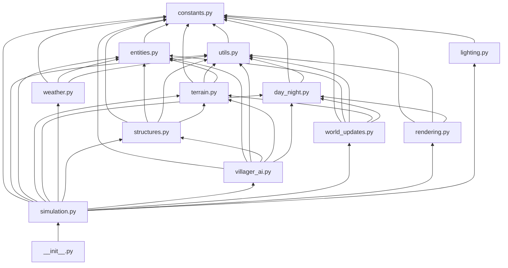

# Living World -- Modular Package Refactoring Plan

Target: Convert [`src/display/living_world.py`](src/display/living_world.py) (2057 lines) into a Python package at `src/display/living_world/`.

---

## A. Package Structure

```
src/display/living_world/
    __init__.py          -- exposes run via from .simulation import run
    constants.py         -- block types, colors, dimensions, templates, masks, timing
    utils.py             -- _clamp, _lerp_color, _cosine_interp, _apply_ambient
    entities.py          -- Cloud, Bird, Tree, Villager, Structure, LumberItem,
                            Firefly, Smoke, FishJump, Flower, RainDrop, GrassFire, Weather
    terrain.py           -- height profile generation, terrain fill, water sim,
                            sand placement, tree placement, valley detection, flattening
    day_night.py         -- day phase computation, ambient factor, sky colors,
                            seasonal color offsets
    weather.py           -- weather state machine, rain drops, lightning, grass fires,
                            water level rise/recede
    structures.py        -- build site finding, bridge helpers, campfire site,
                            mine site, foundation leveling, structure updates, ownership
    villager_ai.py       -- villager update logic, task AI, trading, reproduction,
                            aging, spawning, bubble helpers
    world_updates.py     -- tree growth, cloud/bird movement and spawning,
                            fireflies, smoke, fish jumps, flowers, torch posts
    rendering.py         -- all _render_* functions for every visual element
    lighting.py          -- campfire, lantern, watchtower, and torch post light passes
    simulation.py        -- run function, camera system, tick dispatch, frame loop
```

Total: 13 files (12 submodules + `__init__.py`).

---

## B. Module Dependency Map



### Dependency layers -- strictly acyclic

| Layer | Modules | Depends on |
|-------|---------|------------|
| 0 -- Foundation | `constants` | nothing |
| 1 -- Core | `utils`, `entities` | layer 0 |
| 2 -- Systems | `day_night`, `terrain`, `weather`, `lighting` | layers 0-1 |
| 3 -- Logic | `structures`, `world_updates`, `rendering` | layers 0-2 |
| 4 -- AI | `villager_ai` | layers 0-3 |
| 5 -- Orchestrator | `simulation` | layers 0-4 |
| 6 -- Public API | `__init__` | layer 5 |

---

## C. What Goes Where

### C.1 [`constants.py`](src/display/living_world/constants.py)

All module-level constants, lookup tables, color palettes, templates, and precomputed masks.

| Item | Current lines | Type |
|------|--------------|------|
| `DISPLAY_WIDTH`, `DISPLAY_HEIGHT`, `WORLD_WIDTH`, `WIDTH`, `HEIGHT` | 21-23 | int |
| `FRAME_INTERVAL`, `DAY_CYCLE_SECONDS` | 24-25 | float |
| `AIR`, `GRASS`, `DIRT`, `STONE`, `WATER`, `WOOD`, `LEAF`, `SAND` | 27 | int |
| `LUMBER_BLOCK`, `HOUSE_BLOCK`, `CAMPFIRE_BLOCK`, `PATH_DIRT`, `MINE_BLOCK` | 28 | int |
| `BLOCK_COLORS` | 30-35 | dict |
| `WATER_SURFACE_COLOR` | 37 | tuple |
| `BASE_GROUND`, `TERRAIN_MIN`, `TERRAIN_MAX` | 38 | int |
| `OCTAVES` | 39 | list |
| `BIRD_FRAMES`, `BIRD_COLOR` | 41-45 | list/tuple |
| `SKY_NIGHT` through `SKY_DUSK_LATE` | 47-52 | tuple pairs |
| `SUN_COLOR`, `MOON_COLOR` | 54 | tuple |
| `DYING_LEAF_COLORS` | 55 | list |
| `CAMPFIRE_COLORS`, `CAMPFIRE_LOW_FUEL_COLORS` | 56-57 | list |
| `VILLAGER_SKIN_COLORS`, `VILLAGER_CLOTHES_COLORS` | 58-59 | list |
| `FLOWER_COLORS` | 60 | list |
| `MAX_VILLAGERS`, `VILLAGER_SPAWN_INTERVAL` | 62-63 | int |
| `CAMPFIRE_INITIAL_FUEL`, `CAMPFIRE_REFUEL_AMOUNT`, `CAMPFIRE_LOW_FUEL_THRESHOLD`, `CAMPFIRE_MIN_SPACING` | 64-67 | int |
| `VILLAGER_MIN_AGE`, `VILLAGER_MAX_AGE` | 68 | int |
| `CREMATION_FLASH_FRAMES` | 69 | int |
| `REPRODUCTION_MIN_AGE`, `REPRODUCTION_MAX_AGE`, `REPRODUCTION_CHANCE`, `MAX_CHILDREN` | 70 | int |
| `FLATTEN_DURATION`, `FLATTEN_STEEP_THRESHOLD`, `FLATTEN_EXTREME_THRESHOLD` | 71 | int |
| `MINE_MAX_DEPTH`, `MINE_DIG_FRAMES`, `MAX_MINES`, `MINE_POPULATION_THRESHOLD` | 72 | int |
| `MINE_COLOR`, `STONE_HOUSE_COLOR` | 73-74 | tuple |
| `MAX_BRIDGES`, `BRIDGE_BUILD_FRAMES`, `BRIDGE_COLOR`, `BRIDGE_RAILING_COLOR`, `BRIDGE_MAX_GAP` | 77-81 | int/tuple |
| `WATCHTOWER_COST_LUMBER` through `WATCHTOWER_POPULATION_THRESHOLD` | 84-89 | int |
| `GRANARY_COST_LUMBER` through `GRANARY_POPULATION_THRESHOLD` | 90-94 | int |
| `MAX_TORCH_POSTS`, `TORCH_POST_PATH_THRESHOLD`, `TORCH_POST_CHECK_INTERVAL` | 97-99 | int |
| `BUBBLE_DURATION`, `BUBBLE_COLORS` | 102-109 | int/dict |
| `CAMERA_FOLLOW_RE_EVAL`, `CAMERA_SMOOTH_SPEED` | 111-112 | int |
| `WEATHER_CLEAR`, `WEATHER_CLOUDY`, `WEATHER_RAIN`, `WEATHER_STORM` | 114 | str |
| `WEATHER_DURATION`, `STORM_FACTOR`, `WEATHER_CLOUD_PARAMS` | 115-120 | dict |
| `RAIN_COLOR_BASE`, `RAIN_COUNT_RAIN`, `RAIN_COUNT_STORM` | 121-122 | tuple |
| `LIGHTNING_CHANCE` through `LIGHTNING_GRASS_FIRE_CHANCE` | 123-126 | int/float |
| `TREE_FIRE_DURATION` | 127 | int |
| `WATER_RISE_RAIN_INTERVAL`, `WATER_RISE_STORM_INTERVAL`, `WATER_RECEDE_INTERVAL` | 128 | int |
| `WEATHER_TRANSITION_FRAMES`, `WIND_SWAY_INTERVAL` | 129 | int |
| `HOUSE_TEMPLATES`, `HOUSE_COLORS`, `HOUSE_DIMENSIONS` | 131-153 | dict |
| `GRANARY_TEMPLATE`, `GRANARY_PAL` | 156-157 | list/dict |
| `WT_STONE`, `WT_POLE`, `WT_PLATFORM`, `WT_TORCH` | 160-163 | tuple |
| `LIGHT_MASK` | 165-170 | list -- precomputed campfire |
| `LANTERN_MASK` | 171-176 | list -- precomputed lantern |
| `WATCHTOWER_LIGHT_MASK` | 177-182 | list -- precomputed watchtower |
| `TORCH_POST_LIGHT_MASK` | 183-188 | list -- precomputed torch |

**~170 lines**. No imports from other submodules.

---

### C.2 [`utils.py`](src/display/living_world/utils.py)

Pure utility functions with no side effects.

| Function | Current lines | Signature |
|----------|--------------|-----------|
| `_clamp` | 190-191 | `(v, lo, hi) -> number` |
| `_lerp_color` | 193-194 | `(c1, c2, t) -> tuple` |
| `_cosine_interp` | 196-197 | `(t) -> float` |
| `_apply_ambient` | 199-200 | `(color, factor) -> tuple` |

**~12 lines**. Imports from: `constants` (only `math` stdlib).

---

### C.3 [`entities.py`](src/display/living_world/entities.py)

All entity/data classes. No behavior logic, just `__init__` and trivial computed properties.

| Class | Current lines | Notes |
|-------|--------------|-------|
| `Cloud` | 210-223 | includes `_generate_shape` method |
| `Bird` | 225-230 | includes `screen_y` method |
| `Tree` | 232-239 | growth state, fire state |
| `Villager` | 241-255 | references `VILLAGER_CLOTHES_COLORS`, `VILLAGER_SKIN_COLORS`, `VILLAGER_MIN_AGE`, `VILLAGER_MAX_AGE` from constants |
| `Structure` | 257-265 | references `CAMPFIRE_INITIAL_FUEL`, `MINE_MAX_DEPTH` from constants |
| `LumberItem` | 267-268 | minimal |
| `Firefly` | 270-273 | has lifetime |
| `Smoke` | 275-278 | has dx drift |
| `FishJump` | 280-282 | jump arc progress |
| `Flower` | 284-285 | minimal |
| `RainDrop` | 287-294 | references `RAIN_COLOR_BASE` from constants, `_clamp` from utils |
| `GrassFire` | 296-297 | minimal |
| `Weather` | 299-312 | references `WEATHER_CLEAR`, `WEATHER_DURATION`, `STORM_FACTOR`, `WEATHER_RAIN`, `WEATHER_STORM` from constants |

**~105 lines**. Imports from: `constants`, `utils` (for `_clamp` in `RainDrop.__init__`).

---

### C.4 [`terrain.py`](src/display/living_world/terrain.py)

World generation and terrain modification functions.

| Function | Current lines | Purpose |
|----------|--------------|---------|
| `_generate_height_profile` | 339-348 | Layered sine wave terrain |
| `_fill_terrain` | 350-357 | Populate grid with block layers |
| `_flood_valleys` | 359-376 | Seed water in depressions |
| `_guarantee_pond` | 378-413 | Ensure at least one water body |
| `_simulate_water` | 415-437 | One tick of water cellular automata |
| `_settle_water` | 439-440 | Run water sim N ticks |
| `_place_sand` | 442-452 | Add sand at water edges |
| `_place_trees` | 454-471 | Choose initial tree positions |
| `_generate_stars` | 473-474 | Random star pixel positions |
| `_get_valley_cols` | 476-483 | Find columns near water -- shared helper |
| `_flatten_terrain` | 700-716 | Reduce steep slopes |
| `_find_steep_spot` | 718-726 | Locate steep terrain |
| `_find_extreme_terrain_near_home` | 728-736 | Find extreme slopes near a house |

**~160 lines**. Imports from: `constants`, `utils`, `entities` (for `Tree` constructor).

---

### C.5 [`day_night.py`](src/display/living_world/day_night.py)

Day/night cycle computation -- pure functions, no mutation.

| Function | Current lines | Purpose |
|----------|--------------|---------|
| `_compute_day_phase` | 1200-1201 | Elapsed time to 0.0-1.0 phase |
| `_compute_ambient` | 1203-1214 | Phase to ambient light factor |
| `_get_day_cycle_phase` | 1216-1224 | Phase to named period string |
| `_compute_sky_colors` | 1226-1255 | Phase to sky gradient endpoints |
| `_seasonal_color_offset` | 1257-1266 | Phase to RGB offset for foliage |

**~70 lines**. Imports from: `constants`, `utils`.

---

### C.6 [`weather.py`](src/display/living_world/weather.py)

Weather state machine and weather-driven world effects.

| Function | Current lines | Purpose |
|----------|--------------|---------|
| `_update_weather` | 1817-1846 | State machine transitions, storm factor, wind |
| `_update_rain` | 1848-1874 | Move/spawn/splash rain drops |
| `_update_lightning` | 1876-1898 | Lightning flashes, bolt generation, fire ignition |
| `_update_grass_fires` | 1900-1903 | Tick down grass fire timers |
| `_update_water_levels` | 1905-1930 | Rain-driven water rise and recession |

**~115 lines**. Imports from: `constants`, `entities` (for `RainDrop`, `GrassFire`), `utils`.

---

### C.7 [`structures.py`](src/display/living_world/structures.py)

Structure-related helpers: finding build sites, bridge logic, foundation leveling, ownership.

| Function | Current lines | Purpose |
|----------|--------------|---------|
| `_min_campfire_distance` | 202-207 | Min distance from x to any campfire |
| `_find_water_gap` | 486-517 | Scan for bridgeable water gap |
| `_find_bridge_at` | 519-524 | Check if bridge covers column x |
| `_find_campfire_site` | 1120-1131 | Find valid campfire location |
| `_find_build_site` | 1133-1152 | Find valid house/building location |
| `_find_mine_site` | 1154-1164 | Find valid mine location |
| `_has_mine_at` | 738-742 | Check for mine at column |
| `_level_foundation` | 744-777 | Level terrain for building |
| `_update_structures` | 614-621 | Tick campfire fuel, cremation flash |
| `_transfer_house_ownership` | 638-651 | Reassign house when villager dies |
| `_claim_unowned_house` | 669-682 | Homeless villager claims empty house |

**~130 lines**. Imports from: `constants`, `utils`, `terrain` (for `_get_valley_cols`).

---

### C.8 [`villager_ai.py`](src/display/living_world/villager_ai.py)

All villager behavior: the massive `_update_villagers` function and its supporting logic.

| Function | Current lines | Purpose |
|----------|--------------|---------|
| `_set_bubble` | 527-531 | Set speech bubble on villager |
| `_nearest_campfire_x` | 533-542 | Find closest campfire with fuel |
| `_get_granary` | 544-548 | Find completed granary |
| `_handle_villager_trading` | 623-636 | Lumber trading between nearby villagers |
| `_handle_villager_aging` | 653-667 | Age villagers and handle death |
| `_respawn_if_empty` | 684-698 | Respawn villagers if all died |
| `_update_villagers` | 779-1118 | **Main AI decision tree** -- 340 lines |
| `_maybe_spawn_villager` | 1166-1178 | Periodic villager spawning |
| `_handle_reproduction` | 1180-1197 | Villager reproduction logic |

**~430 lines**. Imports from: `constants`, `entities` (for `Villager`, `Tree`), `utils`, `structures` (for `_find_campfire_site`, `_find_build_site`, `_find_mine_site`, `_find_bridge_at`, `_find_water_gap`, `_level_foundation`, `_min_campfire_distance`, `_transfer_house_ownership`, `_claim_unowned_house`), `terrain` (for `_get_valley_cols`, `_flatten_terrain`, `_find_steep_spot`, `_find_extreme_terrain_near_home`), `day_night` (for `_compute_ambient`).

---

### C.9 [`world_updates.py`](src/display/living_world/world_updates.py)

Non-villager entity updates: trees, clouds, birds, ambient life.

| Function | Current lines | Purpose |
|----------|--------------|---------|
| `_grow_trees` | 551-575 | Tree growth, dying, respawn |
| `_move_clouds` | 577-581 | Cloud position update |
| `_move_birds` | 583-586 | Bird position update |
| `_animate_bird_wings` | 588-589 | Toggle wing frame |
| `_maybe_spawn_bird` | 591-600 | Bird spawning check |
| `_maybe_spawn_cloud` | 602-612 | Cloud spawning check |
| `_update_fireflies` | 1735-1749 | Firefly drift, spawn, despawn |
| `_emit_smoke` | 1751-1762 | Spawn smoke from campfires/chimneys |
| `_update_smoke` | 1765-1770 | Smoke drift and despawn |
| `_maybe_fish_jump` | 1772-1783 | Fish jump spawning |
| `_update_fish_jumps` | 1785-1788 | Fish jump progress |
| `_maybe_grow_flower` | 1790-1800 | Flower spawning |
| `_update_torch_posts` | 1802-1814 | Torch post placement along worn paths |

**~135 lines**. Imports from: `constants`, `entities` (for `Tree`, `Bird`, `Cloud`, `Firefly`, `Smoke`, `FishJump`, `Flower`), `utils`, `terrain` (for `_get_valley_cols`), `day_night` (for `_compute_ambient`).

---

### C.10 [`rendering.py`](src/display/living_world/rendering.py)

All visual rendering functions. These write to the `pixels` image buffer.

| Function | Current lines | Purpose |
|----------|--------------|---------|
| `_render_sky` | 1269-1280 | Sky gradient with weather |
| `_render_sun_moon` | 1282-1304 | Sun/moon arc |
| `_render_stars` | 1306-1312 | Twinkling stars at night |
| `_render_clouds` | 1314-1328 | Cloud shapes with blending |
| `_render_terrain` | 1330-1347 | Block grid with path wear |
| `_render_water` | 1349-1365 | Water with shimmer |
| `_render_flowers` | 1367-1371 | Flower pixels |
| `_render_bridges` | 1373-1381 | Bridge deck and railings |
| `_render_structures` | 1383-1408 | Structure dispatch -- campfire, mine, watchtower, granary, house |
| `_render_house` | 1410-1436 | House template rendering |
| `_render_watchtower` | 1438-1464 | Watchtower pixel art |
| `_render_granary` | 1466-1484 | Granary template rendering |
| `_render_trees` | 1486-1541 | Tree trunk and canopy with wind sway |
| `_render_lumber_items` | 1543-1547 | Dropped lumber items |
| `_render_villagers` | 1549-1569 | Villager head/body with task animation |
| `_render_birds` | 1571-1582 | Bird sprite frames |
| `_render_fish_jumps` | 1584-1591 | Fish jump arcs |
| `_render_smoke` | 1593-1605 | Smoke particle blending |
| `_render_fireflies` | 1607-1614 | Firefly glow |
| `_render_rain` | 1616-1628 | Rain drops and splashes |
| `_render_lightning` | 1630-1641 | Lightning flash and bolt |
| `_render_torch_posts` | 1643-1655 | Torch post with flame |
| `_render_grass_fires` | 1657-1661 | Burning grass pixels |

**~395 lines**. Imports from: `constants`, `utils`, `day_night` (for `_compute_sky_colors`, `_compute_ambient`, `_seasonal_color_offset`).

---

### C.11 [`lighting.py`](src/display/living_world/lighting.py)

Post-processing light passes applied after all rendering.

| Function | Current lines | Purpose |
|----------|--------------|---------|
| `_apply_campfire_light` | 1664-1679 | Warm glow radius 7 around campfires |
| `_apply_lantern_light` | 1681-1699 | Small warm glow radius 3 at house doors |
| `_apply_watchtower_light` | 1701-1716 | Medium glow radius 5 from watchtower torch |
| `_apply_torch_post_light` | 1718-1732 | Small glow radius 2 from path torches |

**~70 lines**. Imports from: `constants` (for `LIGHT_MASK`, `LANTERN_MASK`, `WATCHTOWER_LIGHT_MASK`, `TORCH_POST_LIGHT_MASK`, `DISPLAY_WIDTH`, `DISPLAY_HEIGHT`, `CAMPFIRE_LOW_FUEL_THRESHOLD`).

---

### C.12 [`simulation.py`](src/display/living_world/simulation.py)

Main entry point, camera system, and frame loop orchestration.

| Function | Current lines | Purpose |
|----------|--------------|---------|
| `_select_follow_target` | 315-327 | Pick best villager for camera to follow |
| `_update_camera` | 329-336 | Smooth camera pan toward target |
| `run` | 1933-2057 | **Main entry point** -- init, tick dispatch, render pipeline |

**~155 lines**. Imports from: all other submodules, plus `time`, `random`, `logging`, `PIL.Image`, `src.display._shared.should_stop`.

---

### C.13 [`__init__.py`](src/display/living_world/__init__.py)

```python
"""Living World -- a breathing 2D pixel voxel simulation for 64x64 LED matrix."""

from .simulation import run

__all__ = ["run"]
```

**~4 lines**. Single import re-export.

---

## D. Import Strategy

### D.1 Public API preservation

The existing import path `importlib.import_module("src.display.living_world")` resolves to the package `__init__.py`, which re-exports [`run()`](src/display/living_world/simulation.py) from `simulation.py`. The call `module.run(matrix, duration)` continues to work unchanged. No modifications to [`src/main.py`](src/main.py:348) are required.

### D.2 Inter-module import style

All submodule imports use **relative imports** within the package:

```python
# In structures.py
from .constants import (
    CAMPFIRE_MIN_SPACING, WORLD_WIDTH, DISPLAY_HEIGHT,
    HOUSE_DIMENSIONS, MINE_MAX_DEPTH, BRIDGE_MAX_GAP,
)
from .utils import _clamp
from .terrain import _get_valley_cols
```

```python
# In villager_ai.py
from .constants import (
    MAX_VILLAGERS, VILLAGER_SPAWN_INTERVAL, CAMPFIRE_REFUEL_AMOUNT,
    FLATTEN_DURATION, MINE_DIG_FRAMES, BRIDGE_BUILD_FRAMES,
    HOUSE_TEMPLATES, HOUSE_DIMENSIONS, BUBBLE_COLORS, BUBBLE_DURATION,
    # ...
)
from .utils import _clamp
from .entities import Villager, Tree, Structure
from .structures import (
    _find_campfire_site, _find_build_site, _find_mine_site,
    _find_bridge_at, _find_water_gap, _level_foundation,
    _min_campfire_distance, _transfer_house_ownership, _claim_unowned_house,
)
from .terrain import (
    _get_valley_cols, _flatten_terrain, _find_steep_spot,
    _find_extreme_terrain_near_home,
)
from .day_night import _compute_ambient
```

### D.3 Runtime state -- not module globals

The current file has **no mutable module-level state** (except the precomputed `LIGHT_MASK` lists which are constants). All runtime state -- `world`, `heights`, `villagers`, `structures`, `trees`, etc. -- is created inside [`run()`](src/display/living_world.py:1933) and passed as parameters to every function.

This means the refactoring is straightforward: **no shared mutable state needs to be passed between modules**. Every function receives what it needs as arguments. The parameter signatures remain unchanged.

### D.4 Name convention

All internal functions keep their `_` prefix to indicate they are package-private. Only `run()` is public. The leading underscore convention is preserved but does not prevent inter-submodule access within the package.

### D.5 Stdlib imports

Each submodule imports only the stdlib modules it needs:

| Submodule | Stdlib imports |
|-----------|---------------|
| `constants` | `math` (for `LIGHT_MASK` computation) |
| `utils` | `math` |
| `entities` | `random`, `math` |
| `terrain` | `random`, `math` |
| `day_night` | `math` |
| `weather` | `random` |
| `structures` | `random` |
| `villager_ai` | `random` |
| `world_updates` | `random`, `math` |
| `rendering` | `random`, `math` |
| `lighting` | `random` |
| `simulation` | `time`, `math`, `random`, `logging`, `PIL.Image` |

---

## E. Feature Tracker Structure

The following is the proposed content for `plans/LIVING_WORLD_FEATURES.md`:

```markdown
# Living World -- Feature Tracker

Status key: [x] implemented | [-] partial | [ ] planned

---

## Terrain and World

- [x] Layered sine-wave terrain generation -- terrain.py
- [x] Grass / dirt / stone layer fill -- terrain.py
- [x] Valley detection and water flooding -- terrain.py
- [x] Guaranteed pond if no natural water -- terrain.py
- [x] Water cellular automata simulation -- terrain.py
- [x] Water settling at startup -- terrain.py
- [x] Sand placement at water edges -- terrain.py
- [x] Terrain flattening by villagers -- terrain.py
- [x] Steep spot detection -- terrain.py
- [x] Extreme terrain detection near homes -- terrain.py
- [x] Virtual scrolling world -- 192 columns wide -- simulation.py

## Day/Night Cycle

- [x] 15-minute full day/night cycle -- day_night.py
- [x] Four phases: dawn, day, dusk, night -- day_night.py
- [x] Cosine-interpolated sky gradient -- day_night.py
- [x] Ambient light factor curve -- day_night.py
- [x] Sun arc across daytime sky -- rendering.py
- [x] Moon arc across nighttime sky -- rendering.py
- [x] Twinkling stars at night -- rendering.py
- [x] Seasonal color offsets for foliage -- day_night.py

## Weather System

- [x] Four weather states: clear, cloudy, rain, storm -- weather.py
- [x] State machine transitions -- weather.py
- [x] Storm factor affecting sky brightness -- weather.py
- [x] Wind direction affecting rain angle -- weather.py
- [x] Tree sway in wind -- weather.py
- [x] Weather transition smoothing -- weather.py
- [x] Rain drops with splash effect -- weather.py
- [x] Lightning flash -- full screen brighten -- weather.py
- [x] Lightning bolt rendering -- rendering.py
- [x] Lightning strikes setting trees on fire -- weather.py
- [x] Lightning strikes causing grass fires -- weather.py
- [x] Water level rise during rain/storm -- weather.py
- [x] Water level recession during clear weather -- weather.py

## Trees

- [x] Two canopy styles: round and conical -- entities.py
- [x] Growth animation from sapling to mature -- world_updates.py
- [x] Dying color transition -- green to brown -- rendering.py
- [x] Death and respawn cycle -- world_updates.py
- [x] Tree fire from lightning -- entities.py
- [x] Fire visual rendering -- rendering.py
- [x] Minimum spacing enforcement -- world_updates.py
- [x] Water avoidance for placement -- terrain.py

## Clouds and Birds

- [x] Procedural cloud shape generation -- entities.py
- [x] Cloud movement with weather speed multiplier -- world_updates.py
- [x] Cloud spawn/despawn off screen edges -- world_updates.py
- [x] Weather-driven cloud count targets -- world_updates.py
- [x] Bird wing flap animation -- two frames -- world_updates.py
- [x] Bird sine-wave vertical bobbing -- entities.py
- [x] Bird suppression during storms and night -- world_updates.py

## Villagers

- [x] Villager spawning with random appearance -- villager_ai.py
- [x] Idle/walking/chopping/building/planting states -- villager_ai.py
- [x] Upgrading house state -- villager_ai.py
- [x] Refueling campfire state -- villager_ai.py
- [x] Trading lumber between villagers -- villager_ai.py
- [x] Collecting dropped lumber -- villager_ai.py
- [x] Mining state -- villager_ai.py
- [x] Flattening terrain state -- villager_ai.py
- [x] Resting at home at night -- villager_ai.py
- [x] Entering state for returning home -- villager_ai.py
- [x] Aging and natural death -- villager_ai.py
- [x] Cremation flash at nearest campfire -- villager_ai.py
- [x] Reproduction with age/count limits -- villager_ai.py
- [x] Periodic spawning from world edge -- villager_ai.py
- [x] Respawn if all villagers die -- villager_ai.py
- [x] Night behavior: return home or campfire -- villager_ai.py
- [x] Bad weather: seek shelter -- villager_ai.py
- [x] Speech bubbles for current task -- villager_ai.py
- [x] Bridge-aware pathfinding -- villager_ai.py
- [x] Path wear from walking -- villager_ai.py
- [x] Flower trampling -- villager_ai.py

## Structures

- [x] Campfire with fuel system -- structures.py
- [x] Campfire low fuel visual -- rendering.py
- [x] Campfire minimum spacing -- structures.py
- [x] Small house -- level 1, 3x4 template -- rendering.py
- [x] Medium house -- level 2, 4x6 template with chimney -- rendering.py
- [x] Large house -- level 3, 5x6 template -- rendering.py
- [x] House upgrade path: level 1 to 2 to 3 -- villager_ai.py
- [x] Stone-built house variant -- villager_ai.py
- [x] House ownership and transfer on death -- structures.py
- [x] Under-construction animation -- progressive row reveal -- rendering.py
- [x] 3 color palettes per house level -- constants.py
- [x] Window day/night color change -- rendering.py
- [x] Mine shaft with increasing depth -- villager_ai.py
- [x] Mine shaft visual -- darkening with depth -- rendering.py
- [x] Bridge over water gaps -- structures.py
- [x] Bridge with railings -- rendering.py
- [x] Watchtower -- 2-wide, 7-tall community building -- rendering.py
- [x] Watchtower torch at night -- rendering.py
- [x] Granary -- lumber storage building -- rendering.py
- [x] Granary lumber deposit/withdrawal -- villager_ai.py
- [x] Foundation leveling before building -- structures.py

## Lighting

- [x] Campfire warm glow -- radius 7 -- lighting.py
- [x] House lantern glow -- radius 3 with flicker -- lighting.py
- [x] Watchtower torch glow -- radius 5 -- lighting.py
- [x] Torch post glow -- radius 2 -- lighting.py
- [x] All lights intensity-scaled by night factor -- lighting.py

## Ambient Life

- [x] Fireflies at night with pulsing glow -- world_updates.py
- [x] Smoke particles from campfires -- world_updates.py
- [x] Smoke particles from house chimneys -- world_updates.py
- [x] Fish jump arcs from water surface -- world_updates.py
- [x] Flower spawning on grass -- world_updates.py
- [x] Torch post auto-placement on worn paths -- world_updates.py

## Camera System

- [x] Camera follows highest-scoring villager -- simulation.py
- [x] Smooth camera panning -- simulation.py
- [x] Periodic re-evaluation of follow target -- simulation.py
- [x] Camera clamping to world bounds -- simulation.py

## Rendering Pipeline

- [x] Back-to-front layer compositing -- simulation.py
- [x] 18 FPS target with frame pacing -- simulation.py
- [x] PIL Image-based pixel buffer -- simulation.py
- [x] Render order: sky, sun/moon, stars, clouds, terrain, water,
      flowers, bridges, structures, trees, lumber, villagers, birds,
      fish, smoke, fireflies, rain, grass fires, torch posts,
      lightning, then lighting passes -- simulation.py
```

---

## F. Migration Checklist

These are the implementation steps for the refactoring, in order:

1. Create directory `src/display/living_world/`
2. Create `constants.py` -- extract all constants from lines 20-188
3. Create `utils.py` -- extract utility functions from lines 190-200
4. Create `entities.py` -- extract all classes from lines 210-312
5. Create `terrain.py` -- extract terrain functions from lines 339-483 + 700-736
6. Create `day_night.py` -- extract day/night functions from lines 1200-1266
7. Create `weather.py` -- extract weather functions from lines 1817-1930
8. Create `structures.py` -- extract structure functions from lines 202-207, 486-524, 614-651, 669-682, 738-777, 1120-1164
9. Create `villager_ai.py` -- extract villager functions from lines 527-548, 623-636, 653-698, 779-1197
10. Create `world_updates.py` -- extract entity update functions from lines 551-612, 1735-1814
11. Create `rendering.py` -- extract all render functions from lines 1269-1661
12. Create `lighting.py` -- extract light pass functions from lines 1664-1732
13. Create `simulation.py` -- extract run + camera from lines 315-336, 1933-2057
14. Create `__init__.py` -- single re-export of run
15. Delete the original `src/display/living_world.py` file
16. Run existing tests to verify `importlib.import_module("src.display.living_world").run` still resolves
17. Create `plans/LIVING_WORLD_FEATURES.md` from the feature tracker in section E

## G. more stuf to do
