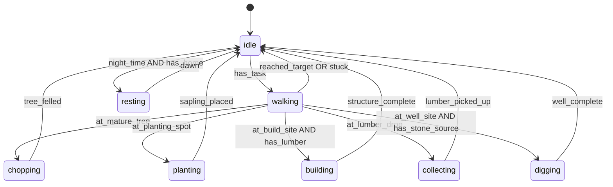
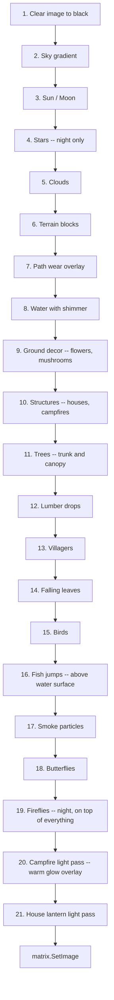
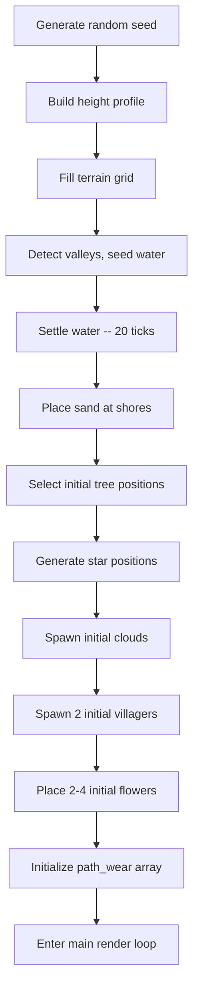

# Living World -- Villagers and Life Systems Expansion

Target file: [`src/display/living_world.py`](src/display/living_world.py)
Builds on: [`plans/living_world_architecture.md`](plans/living_world_architecture.md)

---

## 1. Overview

This document describes the design for expanding the Living World display module with
villagers, structures, campfire lighting, and additional ambient life systems. The goal
is to transform the world from a passive landscape into an actively inhabited scene that
evolves over 15-60 minutes of watching.

All additions follow the existing single-file, no-numpy, plain-Python pattern
established
in the current implementation. New entity classes, simulation functions, and render
functions slot into the existing tick/render pipeline.

---

## 2. New Block Types and Constants

Extend the existing block type IDs in [`living_world.py`](src/display/living_world.py:25):

```python
# New block type IDs -- added after existing SAND = 7
LUMBER     = 8    # dropped resource from chopped trees
HOUSE      = 9    # structure block
CAMPFIRE   = 10   # campfire block
WELL_STONE = 11   # well structure block
WELL_WATER = 12   # water inside a well
FLOWER     = 13   # decorative ground cover
MUSHROOM   = 14   # decorative ground cover
PATH_DIRT  = 15   # worn path from villager foot traffic
```

New color entries for [`BLOCK_COLORS`](src/display/living_world.py:35):

| Block | RGB | Hex | Notes |
|-------|-----|-----|-------|
| `LUMBER` | `(140, 90, 40)` | `#8C5A28` | Lighter than WOOD, stacked logs look |
| `HOUSE` | `(130, 85, 45)` | `#825530` | Warm wood, distinct from terrain |
| `CAMPFIRE` | `(200, 100, 20)` | `#C86414` | Orange base -- animated over this |
| `WELL_STONE` | `(110, 110, 120)` | `#6E6E78` | Slightly lighter than STONE, cobbled look |
| `WELL_WATER` | `(30, 100, 220)` | `#1E64DC` | Brighter than natural WATER, fresh |
| `FLOWER` | `(220, 60, 80)` | `#DC3C50` | Bright pink/red -- pops on green |
| `MUSHROOM` | `(180, 160, 140)` | `#B4A08C` | Pale tan cap |
| `PATH_DIRT` | `(100, 65, 30)` | `#64411E` | Darker than dirt, worn look |

---

## 3. Villager System

### 3.1 Villager Class

```python
class Villager:
    x: float              # horizontal position -- fractional for smooth walking
    y: int                # vertical position -- always on terrain surface
    direction: int        # -1 = facing left, +1 = facing right
    state: str            # current state machine state
    state_timer: int      # frames remaining in current state
    task: dict | None     # current task details -- target x, task type, etc.
    inventory: dict       # items carried: lumber count, saplings, etc.
    skin_color: tuple     # RGB for body pixel
    clothes_color: tuple  # RGB for head/hat pixel
    home: tuple | None    # x,y of assigned house -- None if homeless
    speed: float          # pixels per frame -- 0.15 to 0.25
```

### 3.2 Villager Visual

Each villager is 2 pixels tall, 1 pixel wide:

```
  [H]     <-- head pixel: clothes_color
  [B]     <-- body pixel: skin_color
------    <-- terrain surface
```

Standing on the terrain means the body pixel occupies `surface_y - 1` and the head
occupies `surface_y - 2` for the column the villager is currently in.

#### Color Palette -- Randomized Per Villager

| Part | Options |
|------|---------|
| Skin | `(200, 160, 120)`, `(160, 110, 70)`, `(120, 80, 50)`, `(220, 180, 150)` |
| Clothes | `(180, 40, 40)`, `(40, 80, 180)`, `(40, 160, 60)`, `(180, 160, 40)`, `(140, 60, 160)` |

#### State-Based Color Override

When performing certain actions, the body pixel flashes to indicate activity:

| State | Body Override | Duration |
|-------|--------------|----------|
| Chopping | Alternates body/white every 4 frames | While chopping |
| Building | Alternates body/clothes_color every 6 frames | While building |
| Digging | Alternates body/brown `(120, 72, 36)` every 5 frames | While digging |
| Resting | No change -- sits still | While resting |

### 3.3 State Machine



#### State Descriptions

| State | Behavior | Duration |
|-------|----------|----------|
| `idle` | Stand still, pick a new task after 30-90 frames | 30-90 frames |
| `walking` | Move toward task target at `speed` px/frame, navigate terrain | Until arrival or 300 frames timeout |
| `chopping` | Stand next to a mature tree, animate chop | 120 frames -- ~6.7 seconds |
| `planting` | Place a sapling at current position | 40 frames -- ~2.2 seconds |
| `building` | Construct a structure block by block | 60 frames per block |
| `collecting` | Pick up lumber drop at current position | 20 frames -- ~1.1 seconds |
| `digging` | Dig a well at the current position | 180 frames -- ~10 seconds |
| `resting` | Walk to home and stop moving until dawn | Duration of night phase |

### 3.4 Movement System

#### Walking on Terrain

The villager walks horizontally by incrementing `x` by `speed * direction` each update
tick. The `y` position is always derived from the terrain height at the villager's
current column:

```python
col = int(round(villager.x))
col = clamp(col, 0, WIDTH - 1)
villager.y = heights[col]
```

#### Height Difference Navigation

- **1-block step up/down:** Villager moves freely. The terrain surface difference of 1
  between adjacent columns is handled by simply re-deriving `y` from `heights`.
- **2+ block cliff:** Villager cannot pass. When the height difference between the
  current column and the next column exceeds 1, the villager reverses direction or
  picks a new task.
- **Water avoidance:** Villager will not walk into columns where the surface block is
  `WATER`. Check `world[heights[next_col]][next_col]` before stepping.

#### Pathfinding

No complex pathfinding is needed on a 64-wide 1D terrain surface. The villager simply
walks left or right toward the target X coordinate. If blocked by a cliff or water,
the task is abandoned and a new one is selected after a brief idle period.

### 3.5 Task Selection AI

When a villager enters `idle` state, it evaluates the world and picks a task using
this priority list:

```
1. IF night time AND has home        -> task = REST at home
2. IF nearby lumber drops exist      -> task = COLLECT nearest lumber
3. IF inventory has 4+ lumber AND
      flat build site available      -> task = BUILD a house
4. IF inventory has 2+ lumber AND
      no campfire exists             -> task = BUILD a campfire
5. IF no well exists AND
      valid well site available      -> task = DIG a well
6. IF mature tree within 20 cols     -> task = CHOP nearest mature tree
7. IF no saplings within 15 cols     -> task = PLANT sapling at good spot
8. ELSE                              -> task = WANDER -- walk to random x within 10 cols
```

"Nearby" means within 15 columns of the villager. "Mature tree" means `tree.growth >= 1.0`
and `tree.dying == False`.

#### Task Data Structure

```python
task = {
    "type": "chop" | "plant" | "build_house" | "build_campfire" | "dig_well" | "collect" | "rest" | "wander",
    "target_x": int,           # column to walk to
    "target_tree": Tree | None, # reference for chop tasks
    "build_plan": dict | None,  # structure type and placement for build tasks
}
```

### 3.6 Spawn Timing

| Parameter | Value |
|-----------|-------|
| Initial count | 2 |
| Maximum count | 10 |
| Spawn interval | Every 3240-5400 frames -- ~3-5 minutes at 18 FPS |
| Spawn location | Random grass column, not near water, not overlapping structures |

New villagers appear at a random valid surface position. They start in `idle` state
with empty inventory.

#### Spawn Check Function

```python
def _maybe_spawn_villager(villagers, heights, world, sim_tick):
    if len(villagers) >= MAX_VILLAGERS:
        return
    if sim_tick % VILLAGER_SPAWN_INTERVAL != 0:
        return
    # Find valid spawn column -- grass surface, not near water
    # Create new Villager with random colors
    # Append to villagers list
```

Constants:
```python
MAX_VILLAGERS = 10
VILLAGER_SPAWN_INTERVAL = 3240   # ~3 min at 18 FPS
```

---

## 4. Tree Interaction -- Chopping and Lumber

### 4.1 Chopping a Tree

When a villager reaches a mature tree -- `tree.growth >= 1.0` and `tree.dying == False`:

1. Villager enters `chopping` state, stands 1 column to the left or right of the tree trunk
2. Chopping animation: body pixel alternates with white flash every 4 frames for 120 frames
3. After 120 frames, the tree transitions:
   - `tree.alive = False` -- immediately removed from rendering
   - A lumber drop is placed at the tree's base column

### 4.2 Lumber Drops

Lumber drops are lightweight objects that sit on the terrain surface:

```python
class LumberDrop:
    x: int           # column on terrain
    y: int           # surface_y - 1 at that column
    amount: int      # lumber units -- always 2 per chopped tree
    age: int         # frames since dropped -- despawns after ~5 min
```

Rendering: A single pixel of `LUMBER` color at `(x, y)`.

Despawn: After 5400 frames (~5 minutes), uncollected lumber disappears.

### 4.3 Collecting Lumber

When a villager walks over a lumber drop and enters `collecting` state:

1. Stand still for 20 frames
2. Add the lumber drop's `amount` to `villager.inventory["lumber"]`
3. Remove the lumber drop from the world

### 4.4 Planting Saplings

When a villager enters `planting` state at a valid location:

1. Stand still for 40 frames
2. Create a new [`Tree`](src/display/living_world.py:175) at the current column:
   - `growth = 0.0` -- starts as seedling
   - `max_height = random.randint(5, 9)`
   - `canopy_radius = random.randint(2, 4)`
   - `style = random.randint(0, 1)`
3. The tree enters the existing tree growth system managed by [`_grow_trees()`](src/display/living_world.py:393)

Valid planting location: grass surface, at least 8 columns from any other tree, not
near water, not on a structure.

---

## 5. Structure System

### 5.1 Structure Class

```python
class Structure:
    type: str              # "house_small", "house_large", "campfire", "well"
    x: int                 # left-most column
    y: int                 # top-most row
    width: int             # columns wide
    height: int            # rows tall
    blocks: list           # 2D list of block types or None for empty cells
    door_x: int            # column offset of door within structure
    has_chimney: bool      # for houses -- enables smoke particles
    built_tick: int        # sim_tick when construction completed
```

### 5.2 House Designs

#### Small House -- 2x2

```
[W][W]       W = HOUSE color (130, 85, 45)
[D][W]       D = Door color (60, 35, 15) -- darker
```

- Width: 2, Height: 2
- Door at bottom-left
- Lumber cost: 4

#### Large House -- 4x2

```
[W][W][L][W]    W = HOUSE color
[D][W][W][W]    D = Door, L = Window (180, 200, 220) -- light blue
```

- Width: 4, Height: 2
- Door at bottom-left, window at top-right area
- Lumber cost: 6
- Has chimney flag: True -- enables smoke particles from top-right pixel

### 5.3 Well Design

```
[S][W][S]       S = WELL_STONE color (110, 110, 120)
[S][~][S]       ~ = WELL_WATER color (30, 100, 220) -- animated shimmer
```

- Width: 3, Height: 2
- Stone walls on the sides, open water in the center
- The top-center pixel is the "bucket" position -- alternates between stone and water
  color every 60 frames to suggest a bucket being raised and lowered
- No lumber cost -- requires only labor (digging time)
- Placement: must be on flat terrain, at least 5 columns from any water body, at
  least 3 columns from any other structure
- Max 2 wells per world

#### Well Digging Process

1. Villager walks to the well site and enters `digging` state
2. Digging animation: body pixel alternates with dirt brown `(120, 72, 36)` every 5 frames
3. After 180 frames (~10 seconds), the well structure is placed
4. The terrain at the well center column is modified: the surface block becomes
   `WELL_WATER` -- purely visual, does not interact with the water simulation
5. The two flanking columns get `WELL_STONE` blocks placed above the surface

#### Well Water Animation

The center water pixel shimmers similarly to natural water but with a slightly
brighter palette to suggest clean/fresh water:

```python
WELL_WATER_COLORS = [
    (30, 100, 220),    # base
    (40, 120, 240),    # bright
    (25, 90, 210),     # deep
]
```

The bucket animation on the top-center pixel cycles every 60 frames:
- Frames 0-40: `WELL_STONE` color -- bucket is down
- Frames 40-60: `WELL_WATER` color -- bucket is up with water

### 5.4 Campfire Design

```
[F]          F = Campfire -- animated, see section 6
```

- Width: 1, Height: 1
- Single pixel that animates between orange/yellow/red
- Lumber cost: 2

### 5.5 Placement Rules

Before placing a structure, validate:

1. **Flat terrain:** All columns under the structure must have the same `heights[x]` value -- no height differences
2. **No overlap:** No existing structure within the footprint + 1 column buffer
3. **No water:** No water blocks at or adjacent to the placement area
4. **No trees:** No tree trunks within the footprint + 1 column buffer
5. **Screen bounds:** Structure must be fully within columns 2 to 61

#### Build Site Search

```python
def _find_build_site(structures, trees, heights, world, width, height):
    """Scan terrain for a valid flat area of the given dimensions.
    Returns (x, y) or None if no valid site found.
    """
    for x in range(2, WIDTH - width - 1):
        # Check all columns under footprint have same height
        base_h = heights[x]
        flat = all(heights[x + dx] == base_h for dx in range(width))
        if not flat:
            continue
        # Check no water, structures, or trees in footprint + buffer
        # ...
        return (x, base_h - height)
    return None
```

### 5.6 Structure Construction Animation

When a villager builds a structure:

1. The villager stands adjacent to the build site
2. Each block of the structure appears one at a time, every 60 frames
3. A small 2x2 house takes 4 * 60 = 240 frames (~13 seconds)
4. A large 4x2 house takes 8 * 60 = 480 frames (~27 seconds)
5. A campfire takes 1 * 60 = 60 frames (~3.3 seconds)
6. A well is built all at once after the 180-frame digging period

Blocks appear in order: bottom-left to bottom-right, then top-left to top-right.

### 5.7 Structure Rendering

Structures are rendered after terrain and before trees in the pipeline. Each structure
iterates its `blocks` grid and draws colored pixels at the appropriate world positions,
modulated by ambient light.

Structures are permanent -- they persist for the lifetime of the simulation run.
Stored in a `structures: list[Structure]` alongside other entity lists.

---

## 6. Campfire System

### 6.1 Campfire Animation

The campfire pixel cycles through flame colors every 2-3 frames:

```python
CAMPFIRE_COLORS = [
    (255, 140, 20),    # bright orange
    (255, 200, 40),    # yellow
    (255, 100, 10),    # deep orange
    (220, 60, 10),     # red-orange
    (255, 180, 30),    # warm yellow
]
```

Each frame, the campfire pixel selects a color from this palette with slight randomness:

```python
color_idx = (sim_tick // 2 + random.randint(0, 1)) % len(CAMPFIRE_COLORS)
```

### 6.2 Campfire Light System

Each campfire emits a warm light radius that is most visible at night.

#### Light Parameters

| Parameter | Value |
|-----------|-------|
| Light radius | 7 pixels |
| Max brightness boost | 0.85 -- at the campfire pixel itself |
| Falloff | Linear with distance |
| Warm tint | `(40, 20, 0)` additive -- shifts toward orange |
| Max campfires | 4 -- enforced by build AI |

#### Light Calculation

After the normal ambient dimming pass, for each campfire, iterate all pixels within
the light radius and apply a warm brightness boost:

```python
def _apply_campfire_light(pixels, campfires, ambient):
    """Apply warm light glow from each campfire to nearby pixels."""
    if ambient > 0.6:
        # Campfire light is subtle during the day -- skip for performance
        return

    light_radius = 7
    max_boost = 0.85
    night_factor = max(0.0, (0.6 - ambient) / 0.45)  # 0 at day, 1 at deep night

    for fire in campfires:
        fx, fy = fire.x, fire.y
        for dy in range(-light_radius, light_radius + 1):
            for dx in range(-light_radius, light_radius + 1):
                px, py = fx + dx, fy + dy
                if px < 0 or px >= WIDTH or py < 0 or py >= HEIGHT:
                    continue

                dist = math.sqrt(dx * dx + dy * dy)
                if dist > light_radius:
                    continue

                # Linear falloff: 1.0 at center, 0.0 at edge
                intensity = max(0.0, 1.0 - dist / light_radius)
                boost = intensity * max_boost * night_factor

                # Get current pixel color
                r, g, b = pixels[px, py]

                # Brighten + warm tint
                r = min(255, int(r + r * boost + 40 * intensity * night_factor))
                g = min(255, int(g + g * boost * 0.6 + 20 * intensity * night_factor))
                b = min(255, int(b + b * boost * 0.3))

                pixels[px, py] = (r, g, b)
```

#### Visual Effect

At night, each campfire creates a warm orange circle of light on the terrain. The
effect fades smoothly from bright at center to dark at edges. Multiple campfires
can overlap, creating brighter areas where their radii intersect.

```
Night scene -- campfire light radius visualization:

        . . . . . . . . . . . .
      . . . . 1 1 1 1 1 . . . .     1 = faint glow
    . . . 1 2 2 3 3 2 2 1 . . .     2 = medium glow
    . . 1 2 3 4 F 4 3 2 1 . . .     3 = strong glow
    . . . 1 2 2 3 3 2 2 1 . . .     4 = bright glow
  ====G====G=2=G=G=G=2=G====G====   F = campfire pixel
  ====D====D==D=D=D==D=D====D====   G = grass, D = dirt
```

---

## 7. Additional Life Features

These ambient features make the 64x64 world feel more alive without requiring
complex simulation. Each is a small, self-contained system.

### 7.1 Fireflies -- Dusk and Night

Small glowing dots that drift slowly in the air near the ground during dusk and night.

| Parameter | Value |
|-----------|-------|
| Active phase | Dusk through night -- `day_phase` 0.5 to 0.125 |
| Count | 5-12 active |
| Movement | Random walk: +/- 0.3 px per frame in x and y |
| Vertical range | 3-10 pixels above terrain surface |
| Glow | Single pixel, pulsing brightness: `(180 + 60*sin(tick), 200 + 40*sin(tick), 40)` |
| Spawn | Appear near trees and grass |

```python
class Firefly:
    x: float
    y: float
    phase: float       # sine phase offset for glow pulsing
    lifetime: int      # frames until despawn -- 200-600
```

### 7.2 Smoke Particles

Rising particles from campfires and house chimneys. Tiny 1px wisps that drift upward
and fade out.

| Parameter | Value |
|-----------|-------|
| Emit rate | 1 particle every 8-12 frames per source |
| Movement | Rise at 0.15 px/frame, drift +/- 0.1 px/frame horizontally |
| Lifetime | 40-80 frames |
| Color | Fades from `(120, 120, 130)` to `(60, 60, 70)` to transparent |
| Sources | Campfires always, house chimneys during night |

```python
class SmokeParticle:
    x: float
    y: float
    dx: float          # horizontal drift per frame
    age: int
    max_age: int
```

### 7.3 Flowers and Mushrooms

Small decorative elements that grow on grass surfaces, adding color variety.

| Parameter | Value |
|-----------|-------|
| Flowers | 3-8 scattered on grass, bright colors: red, yellow, purple, white |
| Mushrooms | 1-3 near trees, pale tan/brown |
| Growth | Appear gradually: 1 new flower/mushroom every ~500 frames |
| Max count | 12 flowers, 4 mushrooms |
| Rendering | Single pixel on the grass surface row, replacing the grass color |
| Trampling | Villagers walking over a flower/mushroom removes it -- can regrow later |

```python
class GroundDecor:
    x: int
    y: int             # always surface_y at column x
    type: str          # "flower" or "mushroom"
    color: tuple       # specific color for this instance
    age: int           # frames since placed
```

Flower colors: `(220, 60, 80)`, `(255, 220, 50)`, `(160, 80, 200)`, `(240, 240, 250)`
Mushroom colors: `(180, 160, 140)`, `(200, 180, 160)`

### 7.4 Fish Jumping in Water

Occasional small arcs of a pixel jumping out of pond surfaces.

| Parameter | Value |
|-----------|-------|
| Frequency | 1 jump every 200-400 frames per water body |
| Active phase | Day only -- ambient > 0.5 |
| Animation | Pixel rises 2-3 rows above water surface over 8 frames, then falls back in 8 frames |
| Color | `(160, 160, 180)` -- silvery |
| Splash | On entry, the water surface pixel brightens for 4 frames |

```python
class FishJump:
    x: int             # column -- must be a water surface column
    base_y: int        # water surface row
    progress: int      # 0 to 16 frames -- arc animation
    max_height: int    # 2-3 pixels above surface
```

### 7.5 Falling Leaves

Occasional leaves detach from tree canopies and drift downward.

| Parameter | Value |
|-----------|-------|
| Trigger | Trees with `growth > 0.8` randomly shed 1 leaf every 300-600 frames |
| Dying trees | Shed leaves more frequently: every 60-120 frames |
| Movement | Fall at 0.2 px/frame downward, drift +/- 0.15 px/frame horizontally |
| Color | Same as the tree's current leaf color |
| Despawn | When reaching terrain surface or water |

```python
class FallingLeaf:
    x: float
    y: float
    dx: float          # horizontal drift
    color: tuple       # inherited from parent tree
```

### 7.6 Butterflies -- Daytime

Small 1px creatures that flutter around flowers during the day.

| Parameter | Value |
|-----------|-------|
| Active phase | Day only -- ambient > 0.7 |
| Count | 1-4 active |
| Movement | Erratic: random direction change every 10-20 frames, speed 0.2-0.4 px/frame |
| Vertical range | 2-8 pixels above terrain surface |
| Color | Bright: `(255, 160, 40)` orange, `(100, 180, 255)` blue, `(255, 255, 100)` yellow |
| Behavior | Gravitate toward flowers -- 70% chance to pick a flower as movement target |

```python
class Butterfly:
    x: float
    y: float
    color: tuple
    target_x: int | None    # flower x to flutter toward
    direction_timer: int    # frames until next direction change
```

### 7.7 Worn Paths

Where villagers walk frequently, the terrain surface gradually changes from grass to
a worn dirt path.

| Parameter | Value |
|-----------|-------|
| Tracking | Per-column walk counter incremented each time a villager steps on it |
| Threshold | After 50 steps, grass converts to `PATH_DIRT` |
| Color | `(100, 65, 30)` -- darker than regular dirt |
| Persistence | Permanent for the simulation run |
| Rendering | Replaces the grass surface pixel color at render time |

Implementation: maintain a `path_wear: list[int]` of length `WIDTH`, initialized to 0.
Each villager step increments `path_wear[col]`. During terrain rendering, if
`path_wear[col] >= 50` and the surface block is `GRASS`, render as `PATH_DIRT` color
instead.

### 7.8 Lanterns on Houses at Night

Houses display a small warm light pixel near their door at night.

| Parameter | Value |
|-----------|-------|
| Active phase | Night only -- ambient < 0.3 |
| Position | 1 pixel above the door position of each house |
| Color | `(255, 200, 80)` -- warm yellow, with slight flicker +/- 20 |
| Light radius | 3 pixels -- smaller than campfire |
| Implementation | Treated as a secondary light source in the campfire light pass |

---

## 8. Integration Points

### 8.1 Updated Tick System

Extending the existing tick dispatch in the [`run()`](src/display/living_world.py:884) main loop:

| Subsystem | Tick Interval | Effective Rate | Notes |
|-----------|--------------|----------------|-------|
| Existing: Cloud movement | every frame | 18 Hz | No change |
| Existing: Bird movement | every frame | 18 Hz | No change |
| Existing: Water simulation | every 4 frames | ~4.5 Hz | No change |
| Existing: Bird wing animation | every 4 frames | ~4.5 Hz | No change |
| Existing: Tree growth | every 10 frames | ~1.8 Hz | No change |
| Existing: Bird/cloud spawn | every 90 frames | ~0.2 Hz | No change |
| **Villager movement** | **every 3 frames** | **~6 Hz** | Smooth walking |
| **Villager state machine** | **every 6 frames** | **~3 Hz** | Task decisions |
| **Campfire animation** | **every 2 frames** | **~9 Hz** | Flame flicker |
| **Smoke particles** | **every 3 frames** | **~6 Hz** | Rise and fade |
| **Firefly movement** | **every 2 frames** | **~9 Hz** | Drift and glow |
| **Fish jump check** | **every 200 frames** | **~0.09 Hz** | Rare event |
| **Falling leaves** | **every 4 frames** | **~4.5 Hz** | Drift down |
| **Butterfly movement** | **every 3 frames** | **~6 Hz** | Flutter |
| **Flower/mushroom growth** | **every 500 frames** | **~0.036 Hz** | Very slow |
| **Villager spawn check** | **every 3240 frames** | **~0.006 Hz** | ~3 min |
| **Path wear update** | **every 3 frames** | **~6 Hz** | With villager move |

### 8.2 Updated Tick Dispatch

```python
# Inside the main while loop, after existing tick dispatches:

# Every 2 frames: fireflies, campfire animation
if sim_tick % 2 == 0:
    _update_fireflies(fireflies, day_phase, heights, trees)
    _animate_campfires(structures, sim_tick)

# Every 3 frames: villager movement, smoke, butterflies, path wear
if sim_tick % 3 == 0:
    _move_villagers(villagers, heights, world, structures, trees)
    _update_smoke(smoke_particles)
    _update_butterflies(butterflies, flowers, heights, day_phase)

# Every 4 frames: falling leaves (alongside existing water sim)
if sim_tick % 4 == 0:
    _update_falling_leaves(falling_leaves, heights)
    _maybe_shed_leaf(trees, falling_leaves)

# Every 6 frames: villager state machine decisions
if sim_tick % 6 == 0:
    _update_villager_states(villagers, trees, structures,
                            lumber_drops, heights, world, day_phase)

# Every 200 frames: fish jump
if sim_tick % 200 == 0:
    _maybe_fish_jump(fish_jumps, world, heights, day_phase)

# Every 500 frames: flower/mushroom growth
if sim_tick % 500 == 0:
    _maybe_grow_decor(ground_decor, heights, world, trees)

# Every 3240 frames: villager spawn
if sim_tick % 3240 == 0:
    _maybe_spawn_villager(villagers, heights, world, structures)
```

### 8.3 Updated Render Pipeline

The rendering order in the main loop expands from the existing 8-layer pipeline
at [`living_world.py:953-978`](src/display/living_world.py:953):



Key ordering decisions:
- **Structures before trees:** Trees can overhang structures naturally
- **Villagers after trees:** Villagers are visible walking in front of tree trunks
- **Campfire light pass last:** Applies as a post-process over all rendered pixels
- **Fireflies near-last:** Glow should be visible above everything except light pass
- **Smoke on top:** Rises above structures and terrain

### 8.4 Tree System Interaction

The existing [`_grow_trees()`](src/display/living_world.py:393) function needs modification:

1. **Villager-chopped trees:** When a villager chops a tree, set `tree.alive = False`
   directly. The existing dead tree respawn logic at line 425 handles eventual regrowth,
   but villager-planted saplings take priority as new Tree objects added to the list.

2. **Villager-planted saplings:** New [`Tree`](src/display/living_world.py:175) objects
   are appended to the `trees` list. They enter the normal growth pipeline. No changes
   to `_grow_trees()` needed -- it already handles trees at any growth stage.

3. **Tree count management:** The existing respawn logic creates new trees when dead
   ones have been stumps for 108 frames. With villager planting, cap total tree count
   to avoid overcrowding:
   - Max trees: 12 -- up from current 3-6
   - Natural respawn only if total tree count < 8
   - Villager planting allowed up to max 12

### 8.5 Day/Night Cycle Interaction

The existing [`_compute_ambient()`](src/display/living_world.py:535) and
[`_compute_day_phase()`](src/display/living_world.py:530) functions are used as-is.
New systems check ambient/phase values to determine behavior:

| System | Day Behavior | Night Behavior |
|--------|-------------|----------------|
| Villagers | Active: chop, plant, build, collect | Rest at home or idle near campfire |
| Fireflies | Inactive | Active: drift and glow |
| Butterflies | Active: flutter near flowers | Inactive |
| Fish | Active: occasional jumps | Inactive |
| Smoke | Active from campfires | Active from campfires + house chimneys |
| Campfire light | Subtle | Full warm glow |
| House lanterns | Off | On with flicker |
| Falling leaves | Active | Reduced frequency |

---

## 9. New Entity Lists and Initialization

### 9.1 New State Variables

Add to the initialization section of [`run()`](src/display/living_world.py:884):

```python
# New entity lists
villagers = []
structures = []
lumber_drops = []
fireflies = []
smoke_particles = []
fish_jumps = []
falling_leaves = []
butterflies = []
ground_decor = []
path_wear = [0] * WIDTH

# Spawn initial villagers
for _ in range(2):
    # Find valid grass column, create Villager with random colors
    ...
```

### 9.2 Updated Initialization Sequence



---

## 10. New Function Decomposition

### 10.1 New Classes

| Class | Purpose |
|-------|---------|
| `Villager` | Position, state, inventory, task, appearance |
| `Structure` | Type, position, block layout, metadata |
| `LumberDrop` | Dropped resource on ground |
| `Firefly` | Glowing night insect |
| `SmokeParticle` | Rising smoke wisp |
| `FishJump` | Animated arc above water |
| `FallingLeaf` | Leaf detached from canopy |
| `Butterfly` | Daytime flutter insect |
| `GroundDecor` | Flower or mushroom on grass |

### 10.2 New Simulation Functions

| Function | Signature | Purpose |
|----------|-----------|---------|
| `_move_villagers` | `(villagers, heights, world, structures, trees)` | Walk toward target, navigate terrain |
| `_update_villager_states` | `(villagers, trees, structures, lumber_drops, heights, world, day_phase)` | State machine transitions and task AI |
| `_maybe_spawn_villager` | `(villagers, heights, world, structures)` | Spawn new villager if under cap |
| `_chop_tree` | `(villager, tree, lumber_drops, heights)` | Process tree removal, create lumber drop |
| `_plant_sapling` | `(villager, trees, heights)` | Create new tree at villager position |
| `_build_structure` | `(villager, structures, heights)` | Place structure blocks progressively |
| `_dig_well` | `(villager, structures, heights, world)` | Place well structure after digging |
| `_find_well_site` | `(structures, heights, world) -> int or None` | Find valid column for well |
| `_find_build_site` | `(structures, trees, heights, world, width, height) -> tuple or None` | Locate valid flat area |
| `_update_fireflies` | `(fireflies, day_phase, heights, trees)` | Move, spawn, despawn fireflies |
| `_update_smoke` | `(smoke_particles)` | Move particles upward, fade, despawn |
| `_emit_smoke` | `(smoke_particles, structures, day_phase)` | Create new smoke from sources |
| `_update_butterflies` | `(butterflies, flowers, heights, day_phase)` | Flutter movement, spawn/despawn |
| `_update_falling_leaves` | `(falling_leaves, heights)` | Drift downward, despawn at ground |
| `_maybe_shed_leaf` | `(trees, falling_leaves)` | Randomly detach leaves from canopies |
| `_maybe_fish_jump` | `(fish_jumps, world, heights, day_phase)` | Trigger a fish arc above water |
| `_update_fish_jumps` | `(fish_jumps)` | Advance jump animation frames |
| `_maybe_grow_decor` | `(ground_decor, heights, world, trees)` | Place new flowers/mushrooms |
| `_animate_campfires` | `(structures, sim_tick)` | Update campfire flame color |
| `_apply_campfire_light` | `(pixels, structures, ambient)` | Post-process warm glow |
| `_apply_lantern_light` | `(pixels, structures, ambient)` | Post-process house lantern glow |

### 10.3 New Rendering Functions

| Function | Signature | Purpose |
|----------|-----------|---------|
| `_render_structures` | `(pixels, structures, ambient, sim_tick)` | Draw houses, campfires, and wells |
| `_render_villagers` | `(pixels, villagers, ambient, sim_tick)` | Draw 2px villager sprites |
| `_render_lumber_drops` | `(pixels, lumber_drops, ambient)` | Draw lumber on ground |
| `_render_fireflies` | `(pixels, fireflies, sim_tick)` | Draw glowing dots |
| `_render_smoke` | `(pixels, smoke_particles, ambient)` | Draw fading smoke wisps |
| `_render_fish_jumps` | `(pixels, fish_jumps)` | Draw jumping fish arcs |
| `_render_falling_leaves` | `(pixels, falling_leaves, ambient)` | Draw drifting leaf pixels |
| `_render_butterflies` | `(pixels, butterflies, ambient)` | Draw flutter sprites |
| `_render_ground_decor` | `(pixels, ground_decor, ambient)` | Draw flowers and mushrooms |
| `_render_path_wear` | `(pixels, path_wear, heights, ambient)` | Override grass with path color |
| `_render_lanterns` | `(pixels, structures, ambient, sim_tick)` | Draw lantern pixels on houses |

---

## 11. Performance Considerations

### 11.1 Entity Budget

| Entity Type | Max Count | Pixel Writes per Entity | Total Max Writes |
|-------------|-----------|------------------------|-----------------|
| Villagers | 10 | 2 | 20 |
| Structures | ~8 -- 4 houses + 2 campfires + 2 wells | 2-8 | 56 |
| Lumber drops | ~5 | 1 | 5 |
| Fireflies | 12 | 1 | 12 |
| Smoke particles | ~20 | 1 | 20 |
| Fish jumps | 1 | 1 | 1 |
| Falling leaves | ~8 | 1 | 8 |
| Butterflies | 4 | 1 | 4 |
| Ground decor | 16 | 1 | 16 |
| Path wear | 64 cols | 0 -- modifies existing terrain render | 0 |
| **Subtotal new** | | | **~134** |

Added to the existing ~4000 pixel writes per frame, total is ~4134 -- well within the
55ms frame budget at 18 FPS.

### 11.2 Campfire Light Pass -- Hot Path

The campfire light pass is the most expensive new operation: for each campfire,
iterate a 15x15 pixel area -- 225 pixels per campfire, up to 4 campfires = 900 pixel
reads and writes.

Optimizations:
- **Skip during day:** Only run when `ambient < 0.6`
- **Pre-compute radius mask:** Generate a lookup table of `(dx, dy, intensity)` tuples
  at initialization, reuse each frame
- **Cap at 4 campfires:** Build AI stops creating campfires after 4 exist
- **Integer math:** Use pre-multiplied integer intensity values instead of float division

```python
# Pre-computed at startup:
LIGHT_MASK = []
for dy in range(-7, 8):
    for dx in range(-7, 8):
        dist = math.sqrt(dx * dx + dy * dy)
        if dist <= 7.0:
            intensity = int(255 * (1.0 - dist / 7.0))
            LIGHT_MASK.append((dx, dy, intensity))
```

### 11.3 State Machine -- Negligible Cost

Each villager's state machine runs every 6 frames -- 3 Hz. With max 10 villagers,
that is 10 dictionary lookups and a few integer comparisons per tick. The task
selection AI scans the tree and structure lists -- at most 12 trees and 6 structures --
which is trivial.

### 11.4 Memory Usage

All new entity classes are plain Python objects with a handful of attributes. At maximum
entity counts:

- 10 Villagers: ~10 * 200 bytes = 2 KB
- 6 Structures: ~6 * 500 bytes = 3 KB
- 12 Fireflies: ~1 KB
- 20 Smoke particles: ~1 KB
- Other: ~2 KB

Total new memory: under 10 KB -- negligible.

---

## 12. Implementation Order

Recommended phased approach for implementation:

### Phase 1 -- Core Villager System
1. Add `Villager` class and constants
2. Implement spawn logic -- 2 initial villagers
3. Implement movement on terrain surface
4. Implement basic state machine: idle, walking, wandering
5. Implement villager rendering
6. Test: villagers walk around the terrain

### Phase 2 -- Tree Interaction
7. Add `LumberDrop` class
8. Implement chopping: state, animation, tree removal, lumber creation
9. Implement collecting: pick up lumber drops
10. Implement planting: create new Tree objects
11. Implement task AI for chop/plant/collect decisions
12. Test: villagers chop trees, collect lumber, plant saplings

### Phase 3 -- Structures and Wells
13. Add `Structure` class and house/campfire/well designs
14. Implement build site finding and well site finding
15. Implement building state and progressive construction
16. Implement digging state and well construction
17. Implement structure rendering -- including well water animation
18. Implement task AI for build and dig decisions
19. Test: villagers build houses, campfires, and dig wells

### Phase 4 -- Campfire Light
20. Implement campfire flame animation
21. Implement light radius calculation with pre-computed mask
22. Implement `_apply_campfire_light` post-process
23. Add house lantern rendering and light pass
24. Test: campfire glow visible at night

### Phase 5 -- Villager Night Behavior
25. Implement resting state -- villagers go to houses at night
26. Assign villagers to houses when houses are built
27. Test: day/night villager behavior cycle

### Phase 6 -- Ambient Life Features
28. Implement fireflies
29. Implement smoke particles
30. Implement flowers and mushrooms
31. Implement fish jumping
32. Implement falling leaves
33. Implement butterflies
34. Implement worn paths
35. Test: all ambient features active together

---

## 13. Summary of Key Design Decisions

1. **Villagers as overlays, not grid entities.** Like trees, villagers are rendered from
   a list, not stored in the world grid. This avoids grid corruption and simplifies
   collision with moving entities.

2. **1D terrain navigation only.** The 64-wide surface is effectively a 1D walkway.
   No 2D pathfinding needed -- villagers walk left or right and abandon tasks if blocked.

3. **Priority-based task AI.** Simple ordered priority list rather than utility scoring.
   Deterministic and easy to debug. Produces naturalistic behavior because the priorities
   match what a "reasonable" villager would do.

4. **Campfire light as post-process.** Applying light after all rendering ensures
   consistent interaction with ambient dimming and avoids double-counting brightness.

5. **Phased construction animation.** Structures appear block-by-block rather than
   instantly, giving the player something to watch and making the building process
   visible.

6. **Structures are permanent.** No destruction mechanic -- once built, houses,
   campfires, and wells persist. This keeps the world accumulating complexity over time.

7. **Ambient life features are independent.** Each feature -- fireflies, smoke, fish,
   leaves, butterflies, flowers, paths -- is a self-contained mini-system with its own
   class, update function, and render function. They can be added incrementally without
   affecting each other.

8. **Conservative entity caps.** All entity types have hard maximums to prevent
   unbounded growth. The total pixel write budget stays under 4200 per frame.

9. **Night behavior creates contrast.** Villagers resting, fireflies appearing,
   campfire glow, and house lanterns create a visually distinct night scene compared
   to the active daytime. This makes the day/night cycle feel meaningful.

10. **No numpy dependency.** Consistent with the existing codebase philosophy --
    all data structures are plain Python lists and small classes for maximum portability
    on the Raspberry Pi target hardware.
