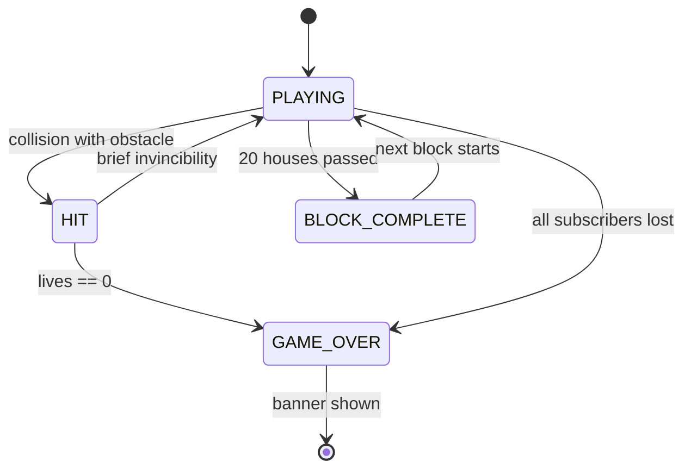

# Package Boy - LED Matrix Game Architecture

## Overview

A Paperboy-inspired side-scroller where an Amazon delivery van drives down a suburban street, tossing packages at houses. Score points for accurate porch deliveries; lose lives for hitting obstacles or missing too many houses.

## Gameplay Concept

- **Perspective**: Top-down, scrolling vertically (street scrolls downward)
- **Player**: Amazon delivery van on the left side of screen, moves up/down
- **Action**: Throw packages to the right, arcing toward house porches
- **Obstacles**: Dogs, trash cans, other cars, pedestrians on sidewalk
- **Houses**: Scroll past on the right side — some are subscribers (lit porch), some are not
- **Goal**: Deliver to all subscriber houses, survive the route

## Screen Layout (64×64)

```
|<-- 16px -->|<--- 24px --->|<--- 24px --->|
|   ROAD     |   SIDEWALK   |   HOUSES     |
|            |              |              |
|  [VAN]     |  obstacles   |  [H] [H]    |
|            |              |  [H] [H]    |
|            |  dog, cans   |  [H] [H]    |
|            |              |              |
```

### Detailed Pixel Layout

| Zone | X Range | Content |
|------|---------|---------|
| Road | 0-15 | Van drives here, other cars as obstacles |
| Sidewalk | 16-35 | Pedestrians, dogs, trash cans |
| Yards/Houses | 36-63 | Houses with porches, fences, mailboxes |

### Scrolling

- Everything scrolls **downward** (van moves "forward" along route)
- Scroll speed increases as game progresses
- New houses and obstacles spawn at top (y=0) and scroll off bottom

## Sprites (Pixel Art)

### Delivery Van (Player) - 5×3 px
```
.XX.
XXXX
.XX.
```
Color: Amazon blue `(0, 120, 200)` with orange stripe `(255, 160, 0)`

### Package (Projectile) - 2×2 px
```
XX
XX
```
Color: Brown `(160, 120, 60)` — arcs from van toward houses

### House - 8×6 px (varies)
```
..XXXX..   <- roof
.XXXXXX.   <- roof
XXXXXXXX   <- walls
XX.XX.XX   <- windows
XX.DD.XX   <- door
XXXXXXXX   <- base
```
Colors vary per house. Subscriber houses have a lit porch (yellow dot).

### Dog (Obstacle) - 3×2 px
```
X.X
XXX
```
Color: Brown `(140, 80, 20)` — runs toward van

### Other Car (Obstacle) - 3×5 px
```
.X.
XXX
.X.
XXX
.X.
```
Color: Random car colors — drives up the road (toward player)

### Trash Can - 2×3 px
```
XX
XX
XX
```
Color: Gray `(80, 80, 80)` — stationary on sidewalk

## Game Mechanics

### Scoring
| Action | Points |
|--------|--------|
| Package lands on porch | +50 |
| Package lands in yard | +10 |
| Package hits window (breaks it) | -25 |
| Missed subscriber house (scrolled off) | -10 per miss |
| Hitting obstacle | Lose 1 life |

### Difficulty Progression
- **Speed**: Scroll rate increases every 10 houses
- **Obstacles**: More dogs, faster cars in later sections
- **Houses**: More subscribers (more throws needed)
- **Bonus round**: After each "block" (20 houses), brief bonus where you throw packages at a target range

### Package Physics
- Thrown at an angle (rightward + slight arc)
- Travel ~20px horizontally over ~15 frames
- Gravity gives a slight downward drift at end
- Player can time throws to hit porches as houses scroll past

### Lives
- Start with 3 lives (delivery attempts)
- Lose a life: collision with obstacle (dog, car, trash can)
- Game over: 0 lives or too many missed houses (subscriber count drops to 0)

## Game State Machine



## Controls (Interactive Mode)

| Input | Action |
|-------|--------|
| UP | Move van up |
| DOWN | Move van down |
| A | Throw package |
| B | Speed boost (brief) |
| Start+Select | Quit to menu |

### Demo Mode (AI)
- Van dodges obstacles using lookahead
- Throws packages when aligned with subscriber house porches
- Occasionally misses for realism
- Auto-restarts on game over

## Technical Implementation

### Data Structures

```python
class House:
    y: float          # current scroll position
    house_type: int   # visual variant (0-3)
    subscriber: bool  # has lit porch (delivery target)
    delivered: bool   # package was delivered
    broken: bool      # window broken by bad throw

class Obstacle:
    x, y: float       # position
    type: str         # 'dog', 'car', 'trash', 'person'
    vx, vy: float    # velocity (cars move up, dogs move left)

class Package:
    x, y: float       # position
    vx, vy: float     # velocity (arc trajectory)
    active: bool
```

### Spawning Logic
- Houses spawn every ~12px of scroll distance
- 60% of houses are subscribers
- Obstacles spawn randomly with minimum spacing
- Cars spawn in road zone, dogs/trash on sidewalk

### Collision Detection
- Van hitbox: 5×3 px
- Package hitbox: 2×2 px
- Porch target zone: 2×2 px area on the house
- Obstacle hitboxes: per-sprite sizes

## Color Palette

| Element | RGB |
|---------|-----|
| Road | (30, 30, 35) |
| Road line (dashed) | (180, 180, 0) |
| Sidewalk | (60, 60, 55) |
| Grass/Yard | (20, 60, 15) |
| Van body | (0, 120, 200) |
| Van stripe | (255, 160, 0) |
| Package | (160, 120, 60) |
| Porch lit | (255, 200, 50) |
| House walls | varies per house |
| Roof | (120, 40, 40) |
| Dog | (140, 80, 20) |
| Score text | (255, 255, 255) |

## Animation Details

| Animation | Description |
|-----------|-------------|
| Van bounce | Subtle 1px vertical oscillation while driving |
| Package arc | Parabolic trajectory rightward |
| Porch flash | Brief green flash on successful delivery |
| Window break | Red flash + star burst on broken window |
| Dog chase | Dog accelerates left toward road |
| Scroll | Continuous downward movement of world |

## File Structure

```
src/display/package_boy.py    # Single file (~500-600 lines)
```

## Integration

- Feature registry: `"package_boy": "src.display.package_boy"`
- PLAYABLE_GAMES: add `"package_boy"`
- Menu label: `"PKG BOY"`
- Config sequence: `{"name": "package_boy", "type": "game", "enabled": true}`
