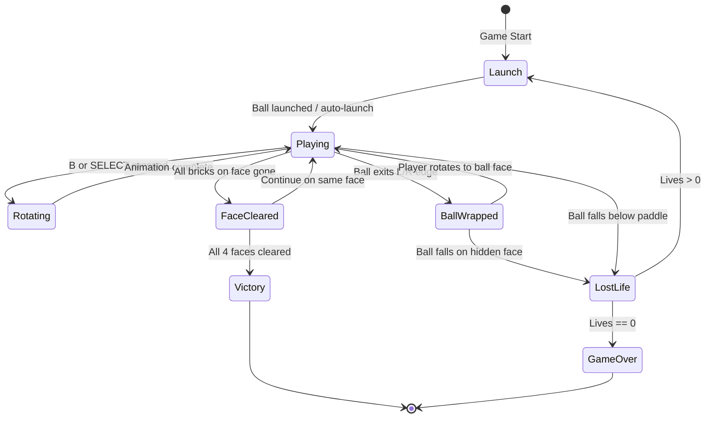

# Super Breakout — Fez-Style Perspective Rotation

## Overview

A Breakout game played on the faces of a 3D cube. The brick field exists on 4 faces (front, left, right, back). The player plays standard Breakout on the currently-visible face but can rotate the entire cube 90° (Fez-style) to reveal new brick layouts. The ball wraps between adjacent faces, motivating strategic rotation.

**File:** `src/display/super_breakout.py`

---

## Screen Layout & Pixel Budget (64×64)

```
┌──────────────────────────────────────────────────────────────────┐  Y=0
│ [SCORE: 3×5 digits]          [FACE ●○○○]        [LIVES: dots]   │  Y=0–5 (HUD: 6px)
├──────────────────────────────────────────────────────────────────┤  Y=6
│                                                                  │
│               BRICK FIELD (56px wide × 28px tall)                │  Y=6–33
│               8 cols × 7 rows of 6×3 bricks + 1px gap           │
│                                                                  │
├──────────────────────────────────────────────────────────────────┤  Y=34
│                                                                  │
│                     PLAY AREA (ball zone)                         │  Y=34–56
│                                                                  │
├──────────────────────────────────────────────────────────────────┤  Y=57
│                         [PADDLE]                                  │  Y=57–59 (3px tall)
├──────────────────────────────────────────────────────────────────┤  Y=60
│  [rotation indicator / edge glow]                                │  Y=60–63 (4px)
└──────────────────────────────────────────────────────────────────┘  Y=63
```

### Pixel Allocation

| Region | Y Range | Height | Purpose |
|--------|---------|--------|---------|
| HUD | 0–5 | 6px | Score, face indicator, lives |
| Brick field | 6–33 | 28px | 7 rows of bricks |
| Play area | 34–56 | 23px | Ball bouncing zone |
| Paddle zone | 57–59 | 3px | Paddle (2px tall + 1px gap) |
| Edge glow | 60–63 | 4px | Rotation arrows / adjacent face peek |

### Brick Dimensions

- **Brick size:** 6px wide × 3px tall
- **Gap:** 1px between bricks (both axes)
- **Grid:** 8 columns × 7 rows = 56 bricks per face
- **Field width:** 8 × (6+1) - 1 = 55px → centered in 64px (4px margin each side)
- **Field height:** 7 × (3+1) - 1 = 27px → fits Y=6 to Y=32

---

## Cube Face Model

### 4 Faces (Horizontal Ring)

The cube only rotates around the Y-axis (horizontal spin), so we use 4 faces arranged in a ring:

```
        ┌───────┐
        │ BACK  │
   ┌────┼───────┼────┐
   │LEFT│ FRONT │RIGHT│
   └────┼───────┼────┘
        │       │
        └───────┘
```

Adjacency (left/right wrapping):
- FRONT → rotate right → RIGHT face
- RIGHT → rotate right → BACK face
- BACK → rotate right → LEFT face
- LEFT → rotate right → FRONT face

### Face Data Structure

```python
@dataclass
class CubeFace:
    name: str                          # front, right, back, left
    bricks: list[dict]                 # [{row, col, hp, color_idx}, ...]
    theme_hue: float                   # Base hue for color theming
    cleared: bool = False              # All bricks destroyed
```

### Brick Layouts Per Face

Each face has a distinct pattern to reward exploration:

| Face | Pattern | Difficulty | Theme Color |
|------|---------|-----------|-------------|
| FRONT | Standard rows (5 rows) | Easy | Blue/Cyan |
| RIGHT | Checkerboard + silver bricks | Medium | Green/Yellow |
| BACK | Diamond fortress (gold center) | Hard | Red/Orange |
| LEFT | Scattered clusters | Medium | Purple/Pink |

---

## Rotation Animation Mechanics

### Fez-Style Rotation (Orthographic Column Compression)

The rotation is NOT a full 3D perspective rotation. It mimics Fez's signature effect:

1. **Duration:** 12 frames (0.4 seconds at 30 FPS)
2. **Effect:** The current face compresses horizontally toward the exit edge while the new face expands from the entry edge

### Animation Phases (rotating RIGHT as example)

```
Frame 0 (start):     Current face shown full-width (56px)
Frames 1–6:          Current face compresses leftward (56→0px)
                     Bricks skew/shear with a slight Y-offset for perspective
                     New face begins expanding from right edge (0→56px)
Frames 7–12:         New face expands to full-width
Frame 12 (end):      New face shown full-width, game resumes
```

### Implementation: Column-Based Shearing

For each animation frame `t` (0.0 to 1.0):

```python
def render_rotation(draw, old_face, new_face, t, direction):
    # direction: +1 = rotating right, -1 = rotating left
    
    # Old face: compress from full width to 0
    old_width = int(FIELD_WIDTH * (1.0 - t))
    # New face: expand from 0 to full width
    new_width = int(FIELD_WIDTH * t)
    
    # Perspective shear: columns further from pivot get Y-offset
    for col in range(old_width):
        x_ratio = col / max(1, old_width)
        y_shear = int(3 * math.sin(x_ratio * math.pi * 0.5) * (1 - t))
        # Draw compressed column of old face with y_shear offset
        
    for col in range(new_width):
        x_ratio = col / max(1, new_width)
        y_shear = int(3 * math.sin((1 - x_ratio) * math.pi * 0.5) * t)
        # Draw expanding column of new face with y_shear offset
```

### Visual Enhancements During Rotation

- **Edge glow:** The edge where rotation occurs glows with the incoming face's theme color
- **Brick depth:** Bricks near the pivot edge appear slightly darker (simulating foreshortening)
- **Particle scatter:** Small pixel particles fly off the compressing edge

---

## Ball & Paddle Behavior

### During Normal Play

Standard breakout mechanics (reuse from existing `breakout.py`):
- Ball: 2×2 pixels, velocity-based movement
- Paddle: 12px wide (normal), 2px tall, constrained to X=4...59
- Wall bounces: top and side walls reflect
- Paddle angle: hit position affects bounce angle

### Ball Wrapping Between Faces

When the ball exits the LEFT or RIGHT edge of the play area:

```python
def check_ball_wrap(ball, current_face_idx):
    if ball.x < LEFT_BOUNDARY:
        # Ball exits left → appears on LEFT-adjacent face's right edge
        ball.x = RIGHT_BOUNDARY - (LEFT_BOUNDARY - ball.x)
        ball.wrap_pending = -1  # Signal: need to rotate LEFT to chase it
        # Ball continues on the adjacent face's data (invisible to player)
        return (current_face_idx - 1) % 4
    elif ball.x > RIGHT_BOUNDARY:
        # Ball exits right → appears on RIGHT-adjacent face's left edge
        ball.x = LEFT_BOUNDARY + (ball.x - RIGHT_BOUNDARY)
        ball.wrap_pending = +1  # Signal: need to rotate RIGHT to chase it
        return (current_face_idx + 1) % 4
    return current_face_idx
```

**Key design:** The ball is logically tracked on whichever face it occupies. If the ball wraps to an adjacent face:
- A **visual indicator** (arrow + glow) appears on the exit edge
- The ball is **invisible** until the player rotates to that face
- The ball continues its physics on the hidden face (bouncing off that face's bricks)
- If the ball falls below paddle-Y on the hidden face, it's lost (life lost)

### During Rotation Animation

- **Ball:** Frozen in place (velocity = 0) for the 12-frame duration
- **Paddle:** Stays at its current X position, carries over to new face
- **After rotation:** Ball resumes with its stored velocity

---

## Ball Wrapping - Edge Indicators

When the ball is on a non-visible face, show:

```
LEFT EDGE INDICATOR          RIGHT EDGE INDICATOR
┌─────────┐                         ┌─────────┐
│ ◄ ● ← ←│  (ball is to the left)  │→ → ● ► │
│ pulsing │                         │ pulsing │
└─────────┘                         └─────────┘
```

- 2px wide pulsing column on the edge where the ball exited
- Color matches the ball's current color
- Pulses faster as the ball approaches the bottom (urgency signal)
- Shows approximate Y-position of ball as a dot on the edge column

---

## Controller Mapping

### Interactive Mode

| Button | Action |
|--------|--------|
| LEFT / RIGHT (D-pad/stick) | Move paddle left/right (3.0 px/frame) |
| A | Launch ball (when stuck to paddle) |
| B | Rotate cube RIGHT (clockwise from top-view) |
| SELECT | Rotate cube LEFT (counter-clockwise) |
| START + SELECT | Quit to menu |

### Why A/B for Launch/Rotate

- **A = launch** is consistent with existing `breakout.py`
- **B = rotate right** is the most natural action button for the signature mechanic
- **SELECT = rotate left** provides symmetry without conflicting with quit combo

### Rotation Cooldown

- Cannot rotate during rotation animation (12 frames)
- Cannot rotate during ball-launch (ball stuck to paddle)
- Minimum 6 frames between rotations (prevent spam)

---

## AI Strategy (Demo Mode)

The AI plays with these priorities:

```python
class SuperBreakoutAI:
    def decide(self, game_state):
        # Priority 1: Track ball (if visible on current face)
        if ball_on_current_face:
            move_paddle_toward_predicted_landing()
            
        # Priority 2: Rotate to chase wrapped ball
        elif ball_on_adjacent_face:
            if ball.y > PADDLE_Y * 0.6:  # Ball getting low
                rotate_toward_ball_face()
            else:
                # Let ball bounce a few times on hidden face
                wait_and_center_paddle()
        
        # Priority 3: Strategic rotation
        elif all_reachable_bricks_cleared():
            rotate_to_face_with_most_bricks()
        
        # Priority 4: Auto-launch when stuck
        if ball_stuck_to_paddle:
            launch_after_short_delay()
```

### AI Rotation Timing

- Rotates every 4–8 seconds during normal play (to showcase the mechanic)
- Immediately chases a wrapped ball if it's in danger
- Occasionally rotates even when bricks remain (demonstrates the feature)
- Adds random "thinking" delays (15–30 frames) before rotating to look natural

---

## Data Structures

```python
# --- Core Game State ---
class SuperBreakoutGame:
    # Cube state
    faces: list[CubeFace]            # 4 faces in ring order
    active_face_idx: int             # 0=front, 1=right, 2=back, 3=left
    ball_face_idx: int               # Which face the ball is physically on
    
    # Rotation state
    rotating: bool
    rotation_direction: int          # +1=right, -1=left
    rotation_progress: float         # 0.0 to 1.0
    rotation_cooldown: int           # Frames before next rotation allowed
    
    # Ball & paddle
    ball: Ball                       # Position, velocity, trail
    paddle_x: float
    paddle_width: int
    ball_stuck: bool
    
    # Game state
    score: int
    lives: int
    total_bricks_remaining: int      # Across all 4 faces
    
    # Visual effects
    particles: list[Particle]
    edge_glow_left: float            # Intensity 0–1 for edge indicators
    edge_glow_right: float
    wrap_indicator_y: float          # Y-position of ball on hidden face
    
    # Timers
    frame_count: int
    game_over: bool
    victory: bool                    # All 4 faces cleared
```

### Face Adjacency Map

```python
FACE_ORDER = ['front', 'right', 'back', 'left']  # Clockwise ring

def adjacent_face(idx, direction):
    return (idx + direction) % 4
```

---

## Color Palette

### Per-Face Brick Themes

| Face | Brick Row Colors (top to bottom) |
|------|----------------------------------|
| FRONT | `#4488FF` → `#44FFCC` (blue to cyan gradient) |
| RIGHT | `#44CC44` → `#FFFF44` (green to yellow) |
| BACK | `#FF4444` → `#FF8800` (red to orange) |
| LEFT | `#CC44FF` → `#FF44AA` (purple to pink) |

### Shared Colors

| Element | Color | Hex |
|---------|-------|-----|
| Background | Black | `#000000` |
| Border / frame | Dark blue | `#0F0F32` |
| Paddle (normal) | Bright cyan | `#50B4FF` |
| Paddle (wide) | Mint | `#50FFB4` |
| Ball | Cycling (same as existing breakout) | Various |
| HUD text | Light gray | `#C8C8C8` |
| Edge glow (ball offscreen) | Ball color, pulsing | Dynamic |
| Multi-hit bricks (2 HP) | Silver | `#B4B4C8` |
| Multi-hit bricks (3 HP) | Gold | `#FFD700` |

### Rotation Animation Colors

- Compressing face: darken by 30% as it recedes
- Expanding face: brighten from 50% to 100% as it reveals
- Edge seam: white flash (2 frames) at the pivot point

---

## Game Flow



---

## Rendering Pipeline (Per Frame)

```python
def render_frame(game):
    image = Image.new('RGB', (64, 64), BG_COLOR)
    draw = ImageDraw.Draw(image)
    
    if game.rotating:
        render_rotation_animation(draw, game)
    else:
        render_bricks(draw, game.faces[game.active_face_idx])
        render_edge_indicators(draw, game)
    
    render_ball(image, game.ball, game.ball_face_idx == game.active_face_idx)
    render_paddle(image, game)
    render_particles(image, game.particles)
    render_hud(draw, game)
    
    matrix.SetImage(image)
```

---

## Victory & Scoring

### Score System

| Action | Points |
|--------|--------|
| Break 1-HP brick | (7 - row) × 10 |
| Break 2-HP brick (final hit) | (7 - row) × 20 |
| Break 3-HP brick (final hit) | (7 - row) × 30 |
| Clear entire face | 500 bonus |
| Clear all 4 faces | 2000 bonus |

### Win Condition

All bricks across all 4 faces destroyed = Victory!
- Total bricks: 4 faces × 56 bricks = 224 bricks maximum
- Actual count varies by layout (some faces have fewer bricks)

### Victory Animation

- All 4 faces rotate rapidly (full spins)
- Rainbow color cycle fills the screen
- Score displayed with fireworks particles

---

## Edge Cases & Polish

### Ball on Hidden Face

- Ball physics continue normally on the hidden face
- Bricks on the hidden face CAN be broken by the ball (bonus for the player who remembers)
- If ball wraps to a 3rd face while already hidden, indicator updates to show new direction
- Maximum one ball in play (no multi-ball for simplicity in the cube version)

### Stuck Prevention

- If ball bounces horizontally for >120 frames without hitting a brick or paddle, add slight downward bias
- If ball wraps back and forth between faces >4 times without player rotating, add stronger vertical component

### Rotation During Ball-in-Danger

- If ball is below Y=50 (close to paddle), rotation is slightly faster (10 frames instead of 12) to avoid unfair deaths
- Ball velocity is preserved through rotation (no free resets)

### Game Duration

- **Demo mode:** Runs for `duration` seconds (default 60), resets on game over
- **Interactive mode:** Runs until game over or quit (no time limit)

---

## Implementation Checklist

When implementing `src/display/super_breakout.py`:

1. Define constants (SIZE, FPS, layout measurements, colors)
2. Implement `CubeFace` class with brick layout generators (4 patterns)
3. Implement `Ball` class (reuse from breakout, add face tracking)
4. Implement `SuperBreakoutGame` class:
   - `__init__`: Set up 4 faces, ball, paddle, state
   - `step()`: Physics tick (ball movement, collisions, wrapping)
   - `rotate()`: Start rotation animation
   - `_update_rotation()`: Progress animation
   - `_check_ball_wrap()`: Handle ball crossing face boundaries
   - `_move_paddle_ai()`: AI decision-making
   - `draw()`: Full render pipeline
5. Implement rotation renderer (column compression + shear)
6. Implement edge glow indicators
7. Implement `_run_demo()` (AI mode)
8. Implement `_run_interactive()` (player mode)
9. Implement `run(matrix, duration=60, controller=None)` entry point
10. Add victory/game-over screens with `show_banner()`

---

## Dependencies

```python
import random
import logging
import time
import math
from PIL import Image, ImageDraw
from src.display._shared import should_stop, interruptible_sleep, show_banner, safe_rumble
from src.display._fonts import _draw_text, _text_width
from src.display._utils import _draw_digit, _draw_number, _scale_color, _hsv_to_rgb
```

Interactive mode additionally imports:
```python
from src.input.controller import wants_quit, Button, EventType
```
